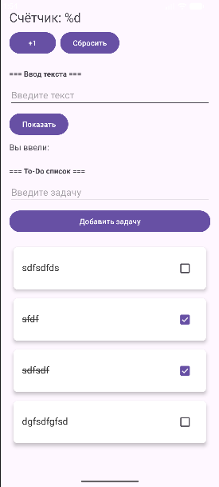
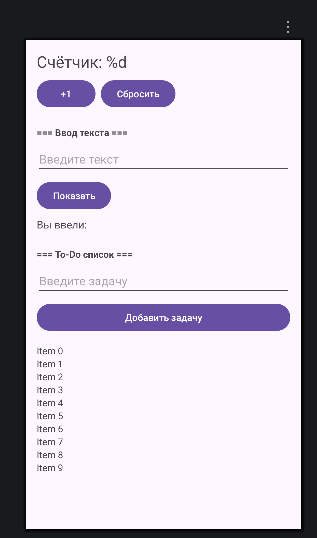

# Лабораторная работа №10

<div align="center">

**МИНИСТЕРСТВО НАУКИ И ВЫСШЕГО ОБРАЗОВАНИЯ РОССИЙСКОЙ ФЕДЕРАЦИИ**  
**ФЕДЕРАЛЬНОЕ ГОСУДАРСТВЕННОЕ БЮДЖЕТНОЕ ОБРАЗОВАТЕЛЬНОЕ УЧРЕЖДЕНИЕ ВЫСШЕГО ОБРАЗОВАНИЯ**  
**«САХАЛИНСКИЙ ГОСУДАРСТВЕННЫЙ УНИВЕРСИТЕТ»**

<br>
<br>

Институт естественных наук и техносферной безопасности  
Кафедра информатики  
**Пахомов Владимир Романович**

<br>
<br>
<br>
<br>

Лабораторная работа №10  
**Интеграция Room в проект. Сохранение списка задач в БД**  
01.03.02 Прикладная математика и информатика  
3 Курс

<br>
<br>
<br>
<br>
<br>
<br>
<br>
<br>
<br>
<br>
<br>
<br>
<br>

<div align="right">
Научный руководитель<br>
Соболев Евгений Игоревич
</div>

<br>
<br>
<br>

г. Южно-Сахалинск  
2026 г.

</div>

## Цель работы

Изучить основы работы с Room Database — официальной библиотекой для работы с SQLite в Android. Научиться создавать Entity, DAO, Database, интегрировать Room с ViewModel и корутинами, обеспечить сохранение списка задач между сессиями приложения.

## Индивидуальное задание: Сортировка задач

В DAO реализован запрос, который возвращает задачи, отсортированные по статусу выполнения (сначала невыполненные, затем выполненные) и по дате создания (новые сверху). Это позволяет пользователю видеть актуальные незавершённые задачи в начале списка.

## Скриншоты





## Листинги

### 1. TaskEntity.kt

```kotlin
package com.example.todoapp.database

import androidx.room.Entity
import androidx.room.PrimaryKey

@Entity(tableName = "tasks")
data class TaskEntity(
    @PrimaryKey(autoGenerate = true)
    val id: Long = 0,
    val title: String,
    val isCompleted: Boolean = false,
    val createdTime: Long = System.currentTimeMillis()
)
```

### 2. TaskDao.kt

```kotlin
package com.example.todoapp.database

import androidx.room.*
import kotlinx.coroutines.flow.Flow

@Dao
interface TaskDao {

    @Query("SELECT * FROM tasks ORDER BY isCompleted ASC, createdTime DESC")
    fun getAllTasks(): Flow<List<TaskEntity>>

    @Insert(onConflict = OnConflictStrategy.REPLACE)
    suspend fun insertTask(task: TaskEntity)

    @Update
    suspend fun updateTask(task: TaskEntity)

    @Delete
    suspend fun deleteTask(task: TaskEntity)

    @Query("DELETE FROM tasks")
    suspend fun deleteAll()
}
```

### 3. AppDatabase.kt

```kotlin
package com.example.todoapp.database

import android.content.Context
import androidx.room.Database
import androidx.room.Room
import androidx.room.RoomDatabase

@Database(
    entities = [TaskEntity::class],
    version = 1,
    exportSchema = false
)
abstract class AppDatabase : RoomDatabase() {
    abstract fun taskDao(): TaskDao

    companion object {
        @Volatile
        private var INSTANCE: AppDatabase? = null

        fun getInstance(context: Context): AppDatabase {
            return INSTANCE ?: synchronized(this) {
                val instance = Room.databaseBuilder(
                    context.applicationContext,
                    AppDatabase::class.java,
                    "todo_database"
                ).build()
                INSTANCE = instance
                instance
            }
        }
    }
}
```

### 4. MainViewModel.kt

```kotlin
package com.example.todoapp

import androidx.lifecycle.ViewModel
import androidx.lifecycle.viewModelScope
import com.example.todoapp.database.AppDatabase
import com.example.todoapp.database.TaskEntity
import kotlinx.coroutines.flow.SharingStarted
import kotlinx.coroutines.flow.StateFlow
import kotlinx.coroutines.flow.stateIn
import kotlinx.coroutines.launch

class MainViewModel(
    private val database: AppDatabase
) : ViewModel() {

    private val taskDao = database.taskDao()

    val tasks: StateFlow<List<TaskEntity>> = taskDao.getAllTasks()
        .stateIn(
            scope = viewModelScope,
            started = SharingStarted.WhileSubscribed(5000),
            initialValue = emptyList()
        )

    fun addTask(title: String) {
        viewModelScope.launch {
            val task = TaskEntity(title = title)
            taskDao.insertTask(task)
        }
    }

    fun deleteTask(task: TaskEntity) {
        viewModelScope.launch {
            taskDao.deleteTask(task)
        }
    }

    fun toggleTaskCompletion(task: TaskEntity, isCompleted: Boolean) {
        viewModelScope.launch {
            val updatedTask = task.copy(isCompleted = isCompleted)
            taskDao.updateTask(updatedTask)
        }
    }
}
```

### 5. MainViewModelFactory.kt

```kotlin
package com.example.todoapp

import androidx.lifecycle.ViewModel
import androidx.lifecycle.ViewModelProvider
import com.example.todoapp.database.AppDatabase

class MainViewModelFactory(
    private val database: AppDatabase
) : ViewModelProvider.Factory {
    override fun <T : ViewModel> create(modelClass: Class<T>): T {
        if (modelClass.isAssignableFrom(MainViewModel::class.java)) {
            @Suppress("UNCHECKED_CAST")
            return MainViewModel(database) as T
        }
        throw IllegalArgumentException("Unknown ViewModel class")
    }
}
```

### 6. TaskAdapter.kt

```kotlin
package com.example.todoapp

import android.graphics.Paint
import android.view.LayoutInflater
import android.view.ViewGroup
import android.widget.CheckBox
import android.widget.TextView
import androidx.recyclerview.widget.RecyclerView
import com.example.todoapp.database.TaskEntity

class TaskAdapter(
    private var tasks: List<TaskEntity>,
    private val onItemClick: (TaskEntity) -> Unit,
    private val onItemLongClick: (TaskEntity) -> Unit,
    private val onCheckChange: (TaskEntity, Boolean) -> Unit
) : RecyclerView.Adapter<TaskAdapter.TaskViewHolder>() {

    class TaskViewHolder(itemView: android.view.View) : RecyclerView.ViewHolder(itemView) {
        val textTask: TextView = itemView.findViewById(R.id.textTask)
        val checkTask: CheckBox = itemView.findViewById(R.id.checkTask)
    }

    override fun onCreateViewHolder(parent: ViewGroup, viewType: Int): TaskViewHolder {
        val view = LayoutInflater.from(parent.context)
            .inflate(R.layout.item_task, parent, false)
        return TaskViewHolder(view)
    }

    override fun onBindViewHolder(holder: TaskViewHolder, position: Int) {
        val task = tasks[position]
        holder.textTask.text = task.title
        holder.checkTask.isChecked = task.isCompleted

        if (task.isCompleted) {
            holder.textTask.paintFlags = holder.textTask.paintFlags or Paint.STRIKE_THRU_TEXT_FLAG
        } else {
            holder.textTask.paintFlags = holder.textTask.paintFlags and Paint.STRIKE_THRU_TEXT_FLAG.inv()
        }

        holder.checkTask.setOnCheckedChangeListener(null)
        holder.checkTask.setOnCheckedChangeListener { _, isChecked ->
            onCheckChange(task, isChecked)
        }

        holder.itemView.setOnClickListener {
            onItemClick(task)
        }

        holder.itemView.setOnLongClickListener {
            onItemLongClick(task)
            true
        }
    }

    override fun getItemCount(): Int = tasks.size

    fun updateData(newTasks: List<TaskEntity>) {
        tasks = newTasks
        notifyDataSetChanged()
    }
}
```

### 7. MainActivity.kt

```kotlin
package com.example.todoapp

import android.content.Intent
import android.os.Bundle
import android.widget.Button
import android.widget.EditText
import android.widget.TextView
import android.widget.Toast
import androidx.activity.viewModels
import androidx.appcompat.app.AppCompatActivity
import androidx.lifecycle.Lifecycle
import androidx.lifecycle.lifecycleScope
import androidx.lifecycle.repeatOnLifecycle
import androidx.recyclerview.widget.LinearLayoutManager
import androidx.recyclerview.widget.RecyclerView
import com.example.todoapp.database.AppDatabase
import kotlinx.coroutines.launch

class MainActivity : AppCompatActivity() {

    private val database by lazy { AppDatabase.getInstance(this) }
    private val viewModel: MainViewModel by viewModels {
        MainViewModelFactory(database)
    }

    private lateinit var adapter: TaskAdapter
    private lateinit var textCounter: TextView
    private lateinit var textEntered: TextView
    private var counter = 0

    override fun onCreate(savedInstanceState: Bundle?) {
        super.onCreate(savedInstanceState)
        setContentView(R.layout.activity_main)

        textCounter = findViewById(R.id.textCounter)
        textEntered = findViewById(R.id.textEntered)
        val buttonIncrement = findViewById<Button>(R.id.buttonIncrement)
        val buttonReset = findViewById<Button>(R.id.buttonReset)
        val editTextInput = findViewById<EditText>(R.id.editTextInput)
        val buttonShow = findViewById<Button>(R.id.buttonShow)
        val editTextTask = findViewById<EditText>(R.id.editTextTask)
        val buttonAddTask = findViewById<Button>(R.id.buttonAddTask)
        val recyclerView = findViewById<RecyclerView>(R.id.recyclerViewTasks)

        recyclerView.layoutManager = LinearLayoutManager(this)
        adapter = TaskAdapter(
            tasks = emptyList(),
            onItemClick = { task ->
                val intent = Intent(this, DetailActivity::class.java)
                intent.putExtra("task_text", task.title)
                startActivity(intent)
            },
            onItemLongClick = { task ->
                viewModel.deleteTask(task)
                Toast.makeText(this, "Задача удалена", Toast.LENGTH_SHORT).show()
            },
            onCheckChange = { task, isChecked ->
                viewModel.toggleTaskCompletion(task, isChecked)
            }
        )
        recyclerView.adapter = adapter

        lifecycleScope.launch {
            repeatOnLifecycle(Lifecycle.State.STARTED) {
                viewModel.tasks.collect { tasks ->
                    adapter.updateData(tasks)
                }
            }
        }

        buttonIncrement.setOnClickListener {
            counter++
            updateCounterDisplay()
        }

        buttonReset.setOnClickListener {
            counter = 0
            updateCounterDisplay()
        }

        buttonShow.setOnClickListener {
            val inputText = editTextInput.text.toString()
            if (inputText.isNotBlank()) {
                textEntered.text = "${getString(R.string.label_entered)} $inputText"
                editTextInput.text.clear()
            } else {
                Toast.makeText(this, "Введите текст", Toast.LENGTH_SHORT).show()
            }
        }

        buttonAddTask.setOnClickListener {
            val task = editTextTask.text.toString()
            if (task.isNotBlank()) {
                viewModel.addTask(task)
                editTextTask.text.clear()
            } else {
                Toast.makeText(this, "Введите задачу", Toast.LENGTH_SHORT).show()
            }
        }

        if (savedInstanceState != null) {
            counter = savedInstanceState.getInt("counter", 0)
            updateCounterDisplay()
        }
    }

    private fun updateCounterDisplay() {
        textCounter.text = getString(R.string.counter_text, counter)
    }

    override fun onSaveInstanceState(outState: Bundle) {
        super.onSaveInstanceState(outState)
        outState.putInt("counter", counter)
    }
}
```

### 8. DetailActivity.kt

```kotlin
package com.example.todoapp

import android.os.Bundle
import android.widget.Button
import android.widget.TextView
import androidx.appcompat.app.AppCompatActivity

class DetailActivity : AppCompatActivity() {
    override fun onCreate(savedInstanceState: Bundle?) {
        super.onCreate(savedInstanceState)
        setContentView(R.layout.activity_detail)

        val textTaskDetail = findViewById<TextView>(R.id.textTaskDetail)
        val buttonBack = findViewById<Button>(R.id.buttonBack)

        val taskText = intent.getStringExtra("task_text") ?: "Нет данных"
        textTaskDetail.text = taskText

        buttonBack.setOnClickListener {
            finish()
        }
    }
}
```

### 9. AndroidManifest.xml

```xml
<?xml version="1.0" encoding="utf-8"?>
<manifest xmlns:android="http://schemas.android.com/apk/res/android"
    package="com.example.todoapp">

    <application
        android:allowBackup="true"
        android:icon="@mipmap/ic_launcher"
        android:label="@string/app_name"
        android:roundIcon="@mipmap/ic_launcher_round"
        android:supportsRtl="true"
        android:theme="@style/Theme.TodoApp">
        
        <activity
            android:name=".MainActivity"
            android:exported="true">
            <intent-filter>
                <action android:name="android.intent.action.MAIN" />
                <category android:name="android.intent.category.LAUNCHER" />
            </intent-filter>
        </activity>
        
        <activity android:name=".DetailActivity" />
        
    </application>

</manifest>
```

## Ответы на контрольные вопросы

**1. Для чего нужна библиотека Room? Какие проблемы она решает по сравнению с прямым использованием SQLite?**

Room — это библиотека-обёртка над SQLite. Она решает следующие проблемы: автоматическая генерация кода, проверка SQL-запросов на этапе компиляции, снижение шаблонного кода, интеграция с корутинами и Flow, упрощение миграции базы данных.

**2. Назовите три основных компонента Room и объясните их назначение.**

- **Entity** — класс, представляющий таблицу в БД. Каждое поле — столбец.
- **DAO (Data Access Object)** — интерфейс с методами для доступа к данным (вставка, удаление, запросы).
- **Database** — абстрактный класс, связывающий Entity и DAO, точка доступа к БД.

**3. Почему методы DAO, изменяющие данные, объявляются как `suspend`?**

Методы DAO выполняют дисковые операции, которые не должны блокировать главный поток (UI). `suspend` позволяет вызывать эти методы из корутины, которая приостанавливается без блокировки потока и возобновляется после завершения операции в фоновом потоке.

**4. Что такое `Flow` и почему его удобно использовать с Room?**

`Flow` — это холодный асинхронный поток данных из Kotlin Coroutines. Его удобно использовать с Room, потому что Room может возвращать `Flow` из запроса, и этот Flow будет автоматически обновляться при каждом изменении данных в таблице. UI подписывается на Flow и получает актуальные данные без лишних запросов.

**5. Как Room обеспечивает проверку SQL-запросов на этапе компиляции?**

Room обрабатывает аннотации с SQL-запросами (`@Query`, `@Insert`, `@Update`, `@Delete`) с помощью процессора аннотаций (kapt или KSP) во время компиляции. Если в SQL-запросе синтаксическая ошибка или таблица не существует, компиляция завершится с ошибкой, а не в рантайме.

**6. Зачем нужен паттерн Singleton для экземпляра базы данных?**

Создание экземпляра `RoomDatabase` — затратная операция. Singleton гарантирует, что во всём приложении существует только один экземпляр БД, что экономит ресурсы и предотвращает конфликты при одновременном доступе к базе данных из разных мест.

## Вывод

В ходе выполнения лабораторной работы №10 приложение `TodoApp` было дополнено сохранением списка задач в локальную базу данных с использованием Room.

В процессе работы были изучены и применены на практике:
- **Room Database** — для создания и управления SQLite-базой данных
- **Entity** — создана таблица `tasks` с полями id, title, isCompleted, createdTime
- **DAO** — реализованы методы для получения (с сортировкой), вставки, обновления и удаления задач
- **KSP (Kotlin Symbol Processing)** — использован вместо kapt для генерации кода Room
- **StateFlow** — для реактивного получения списка задач из БД
- **ViewModel и корутины** — для асинхронного выполнения операций с БД
