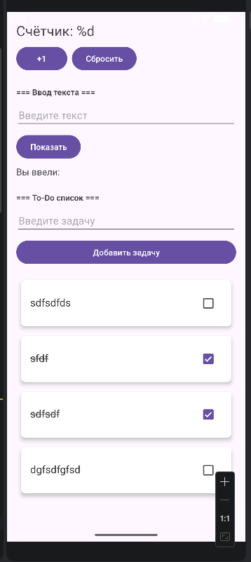
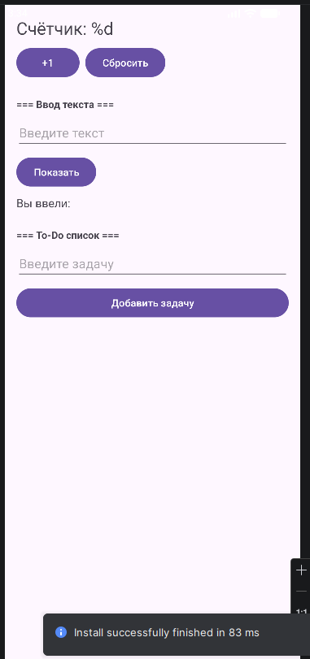

# Лабораторная работа №11

<div align="center">

**МИНИСТЕРСТВО НАУКИ И ВЫСШЕГО ОБРАЗОВАНИЯ РОССИЙСКОЙ ФЕДЕРАЦИИ**  
**ФЕДЕРАЛЬНОЕ ГОСУДАРСТВЕННОЕ БЮДЖЕТНОЕ ОБРАЗОВАТЕЛЬНОЕ УЧРЕЖДЕНИЕ ВЫСШЕГО ОБРАЗОВАНИЯ**  
**«САХАЛИНСКИЙ ГОСУДАРСТВЕННЫЙ УНИВЕРСИТЕТ»**

<br>
<br>

Институт естественных наук и техносферной безопасности  
Кафедра информатики  
**Пахомов Владимир Романович**

<br>
<br>
<br>
<br>

Лабораторная работа №11  
**Рефакторинг: добавление слоя Repository между ViewModel и Room**  
01.03.02 Прикладная математика и информатика  
3 Курс

<br>
<br>
<br>
<br>
<br>
<br>
<br>
<br>
<br>
<br>
<br>
<br>
<br>

<div align="right">
Научный руководитель<br>
Соболев Евгений Игоревич
</div>

<br>
<br>
<br>

г. Южно-Сахалинск  
2026 г.

</div>

## Цель работы

Изучить архитектурный паттерн Repository, научиться выделять слой доступа к данным, отделяя его от бизнес-логики, выполнить рефакторинг существующего приложения для использования репозитория.

## Индивидуальное задание: Добавление источника данных "In-Memory"

Создана альтернативная реализация `TaskRepository` — `InMemoryTaskRepository`, которая хранит список задач в оперативной памяти (без использования базы данных). Переключение между Room-репозиторием и In-Memory репозиторием происходит заменой одной строки в `MainActivity`, что демонстрирует гибкость архитектуры: ViewModel не зависит от конкретной реализации репозитория.

## Скриншоты





## Листинги

### 1. TaskRepository.kt

```kotlin
package com.example.todoapp.data.repository

import com.example.todoapp.database.TaskEntity
import kotlinx.coroutines.flow.Flow

interface TaskRepository {
    fun getAllTasks(): Flow<List<TaskEntity>>
    suspend fun addTask(title: String)
    suspend fun deleteTask(task: TaskEntity)
    suspend fun updateTask(task: TaskEntity)
    suspend fun toggleTaskCompletion(task: TaskEntity, isCompleted: Boolean)
    suspend fun deleteAllTasks()
}
```

### 2. TaskRepositoryImpl.kt

```kotlin
package com.example.todoapp.data.repository

import com.example.todoapp.database.TaskDao
import com.example.todoapp.database.TaskEntity
import kotlinx.coroutines.flow.Flow

class TaskRepositoryImpl(
    private val taskDao: TaskDao
) : TaskRepository {

    override fun getAllTasks(): Flow<List<TaskEntity>> = taskDao.getAllTasks()

    override suspend fun addTask(title: String) {
        val task = TaskEntity(title = title)
        taskDao.insertTask(task)
    }

    override suspend fun deleteTask(task: TaskEntity) {
        taskDao.deleteTask(task)
    }

    override suspend fun updateTask(task: TaskEntity) {
        taskDao.updateTask(task)
    }

    override suspend fun toggleTaskCompletion(task: TaskEntity, isCompleted: Boolean) {
        val updatedTask = task.copy(isCompleted = isCompleted)
        taskDao.updateTask(updatedTask)
    }

    override suspend fun deleteAllTasks() {
        taskDao.deleteAll()
    }
}
```

### 3. InMemoryTaskRepository.kt (индивидуальное задание)

```kotlin
package com.example.todoapp.data.repository

import com.example.todoapp.database.TaskEntity
import kotlinx.coroutines.flow.Flow
import kotlinx.coroutines.flow.MutableStateFlow
import kotlinx.coroutines.flow.asStateFlow

class InMemoryTaskRepository : TaskRepository {

    private val _tasks = MutableStateFlow<List<TaskEntity>>(emptyList())
    private var nextId = 1L

    override fun getAllTasks(): Flow<List<TaskEntity>> = _tasks.asStateFlow()

    override suspend fun addTask(title: String) {
        val newTask = TaskEntity(
            id = nextId++,
            title = title,
            isCompleted = false,
            createdTime = System.currentTimeMillis()
        )
        _tasks.value = _tasks.value + newTask
    }

    override suspend fun deleteTask(task: TaskEntity) {
        _tasks.value = _tasks.value.filter { it.id != task.id }
    }

    override suspend fun updateTask(task: TaskEntity) {
        _tasks.value = _tasks.value.map {
            if (it.id == task.id) task else it
        }
    }

    override suspend fun toggleTaskCompletion(task: TaskEntity, isCompleted: Boolean) {
        updateTask(task.copy(isCompleted = isCompleted))
    }

    override suspend fun deleteAllTasks() {
        _tasks.value = emptyList()
    }
}
```

### 4. MainViewModel.kt

```kotlin
package com.example.todoapp.ui.theme

import androidx.lifecycle.ViewModel
import androidx.lifecycle.viewModelScope
import com.example.todoapp.data.repository.TaskRepository
import com.example.todoapp.database.TaskEntity
import kotlinx.coroutines.flow.SharingStarted
import kotlinx.coroutines.flow.StateFlow
import kotlinx.coroutines.flow.stateIn
import kotlinx.coroutines.launch

class MainViewModel(
    private val repository: TaskRepository
) : ViewModel() {

    val tasks: StateFlow<List<TaskEntity>> = repository.getAllTasks()
        .stateIn(
            scope = viewModelScope,
            started = SharingStarted.WhileSubscribed(5000),
            initialValue = emptyList()
        )

    fun addTask(title: String) {
        viewModelScope.launch {
            repository.addTask(title)
        }
    }

    fun deleteTask(task: TaskEntity) {
        viewModelScope.launch {
            repository.deleteTask(task)
        }
    }

    fun toggleTaskCompletion(task: TaskEntity, isCompleted: Boolean) {
        viewModelScope.launch {
            repository.toggleTaskCompletion(task, isCompleted)
        }
    }

    fun deleteAllTasks() {
        viewModelScope.launch {
            repository.deleteAllTasks()
        }
    }
}
```

### 5. MainViewModelFactory.kt

```kotlin
package com.example.todoapp

import androidx.lifecycle.ViewModel
import androidx.lifecycle.ViewModelProvider
import com.example.todoapp.data.repository.TaskRepository
import com.example.todoapp.ui.theme.MainViewModel

class MainViewModelFactory(
    private val repository: TaskRepository
) : ViewModelProvider.Factory {
    override fun <T : ViewModel> create(modelClass: Class<T>): T {
        if (modelClass.isAssignableFrom(MainViewModel::class.java)) {
            @Suppress("UNCHECKED_CAST")
            return MainViewModel(repository) as T
        }
        throw IllegalArgumentException("Unknown ViewModel class")
    }
}
```

### 6. MainActivity.kt

```kotlin
package com.example.todoapp

import android.content.Intent
import android.os.Bundle
import android.widget.Button
import android.widget.EditText
import android.widget.TextView
import android.widget.Toast
import androidx.activity.viewModels
import androidx.appcompat.app.AppCompatActivity
import androidx.lifecycle.Lifecycle
import androidx.lifecycle.lifecycleScope
import androidx.lifecycle.repeatOnLifecycle
import androidx.recyclerview.widget.LinearLayoutManager
import androidx.recyclerview.widget.RecyclerView
import com.example.todoapp.data.repository.TaskRepositoryImpl
import com.example.todoapp.data.repository.InMemoryTaskRepository
import com.example.todoapp.database.AppDatabase
import com.example.todoapp.ui.theme.MainViewModel
import kotlinx.coroutines.launch

class MainActivity : AppCompatActivity() {

    private val database by lazy { AppDatabase.getInstance(this) }

    // Для работы с Room (сохранение между сессиями)
    //private val repository by lazy { TaskRepositoryImpl(database.taskDao()) }

    // Для In-Memory (индивидуальное задание — данные не сохраняются)
    private val repository by lazy { InMemoryTaskRepository() }

    private val viewModel: MainViewModel by viewModels {
        MainViewModelFactory(repository)
    }

    private lateinit var adapter: TaskAdapter
    private lateinit var textCounter: TextView
    private lateinit var textEntered: TextView
    private var counter = 0

    override fun onCreate(savedInstanceState: Bundle?) {
        super.onCreate(savedInstanceState)
        setContentView(R.layout.activity_main)

        textCounter = findViewById(R.id.textCounter)
        textEntered = findViewById(R.id.textEntered)
        val buttonIncrement = findViewById<Button>(R.id.buttonIncrement)
        val buttonReset = findViewById<Button>(R.id.buttonReset)
        val editTextInput = findViewById<EditText>(R.id.editTextInput)
        val buttonShow = findViewById<Button>(R.id.buttonShow)
        val editTextTask = findViewById<EditText>(R.id.editTextTask)
        val buttonAddTask = findViewById<Button>(R.id.buttonAddTask)
        val recyclerView = findViewById<RecyclerView>(R.id.recyclerViewTasks)

        recyclerView.layoutManager = LinearLayoutManager(this)
        adapter = TaskAdapter(
            tasks = emptyList(),
            onItemClick = { task ->
                val intent = Intent(this, DetailActivity::class.java)
                intent.putExtra("task_text", task.title)
                startActivity(intent)
            },
            onItemLongClick = { task ->
                viewModel.deleteTask(task)
                Toast.makeText(this, "Задача удалена", Toast.LENGTH_SHORT).show()
            },
            onCheckChange = { task, isChecked ->
                viewModel.toggleTaskCompletion(task, isChecked)
            }
        )
        recyclerView.adapter = adapter

        lifecycleScope.launch {
            repeatOnLifecycle(Lifecycle.State.STARTED) {
                viewModel.tasks.collect { tasks ->
                    adapter.updateData(tasks)
                }
            }
        }

        buttonIncrement.setOnClickListener {
            counter++
            updateCounterDisplay()
        }

        buttonReset.setOnClickListener {
            counter = 0
            updateCounterDisplay()
        }

        buttonShow.setOnClickListener {
            val inputText = editTextInput.text.toString()
            if (inputText.isNotBlank()) {
                textEntered.text = "${getString(R.string.label_entered)} $inputText"
                editTextInput.text.clear()
            } else {
                Toast.makeText(this, "Введите текст", Toast.LENGTH_SHORT).show()
            }
        }

        buttonAddTask.setOnClickListener {
            val task = editTextTask.text.toString()
            if (task.isNotBlank()) {
                viewModel.addTask(task)
                editTextTask.text.clear()
            } else {
                Toast.makeText(this, "Введите задачу", Toast.LENGTH_SHORT).show()
            }
        }

        if (savedInstanceState != null) {
            counter = savedInstanceState.getInt("counter", 0)
            updateCounterDisplay()
        }
    }

    private fun updateCounterDisplay() {
        textCounter.text = getString(R.string.counter_text, counter)
    }

    override fun onSaveInstanceState(outState: Bundle) {
        super.onSaveInstanceState(outState)
        outState.putInt("counter", counter)
    }
}
```

## Ответы на контрольные вопросы

**1. Какую роль выполняет слой Repository в архитектуре приложения?**

Repository инкапсулирует логику доступа к данным, предоставляя единый API для работы с данными из различных источников (база данных, сеть, кэш). Он находится между источниками данных и бизнес-логикой (ViewModel), скрывая детали реализации.

**2. Какие преимущества даёт использование Repository по сравнению с прямым обращением к DAO из ViewModel?**

- Разделение ответственности: ViewModel не знает, откуда берутся данные
- Упрощение тестирования: можно подставить mock-репозиторий
- Гибкость: смена источника данных не требует изменений в ViewModel
- Единая точка доступа: упрощает добавление кэширования или логирования

**3. Как изменится ViewModel, если мы захотим добавить ещё один источник данных (например, сетевое API)?**

ViewModel не изменится вообще. Достаточно создать новую реализацию репозитория (например, `NetworkTaskRepository`), которая будет получать данные из API, и передать её во ViewModel вместо текущей. Интерфейс репозитория остаётся тем же.

**4. Почему методы репозитория объявлены как `suspend`?**

Методы репозитория выполняют дисковые или сетевые операции, которые не должны блокировать главный поток. `suspend` позволяет вызывать их из корутины, которая приостанавливается без блокировки потока и возобновляется после завершения операции.

**5. Что такое инверсия зависимостей и как она применяется в данном рефакторинге?**

Инверсия зависимостей — принцип, согласно которому модули верхнего уровня не должны зависеть от модулей нижнего уровня, оба должны зависеть от абстракций. В рефакторинге ViewModel зависит от интерфейса `TaskRepository`, а не от конкретной реализации (`TaskRepositoryImpl` или `InMemoryTaskRepository`). Это позволяет легко заменять реализацию.

## Вывод

В ходе выполнения лабораторной работы №11 был проведён рефакторинг приложения `TodoApp`: между ViewModel и Room добавлен слой Repository.

В процессе работы были изучены и применены на практике:
- **Паттерн Repository** — для инкапсуляции логики доступа к данным
- **Интерфейс репозитория** — для определения контракта работы с данными
- **Инверсия зависимостей** — ViewModel зависит от абстракции, а не от конкретной реализации
- **Альтернативная реализация In-Memory** — создана вторая реализация репозитория, хранящая данные в памяти
