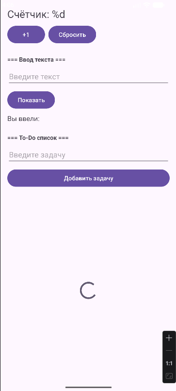
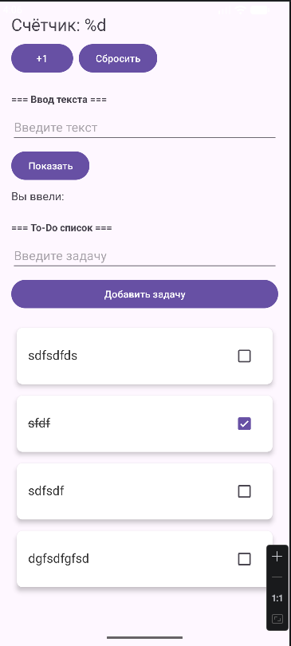
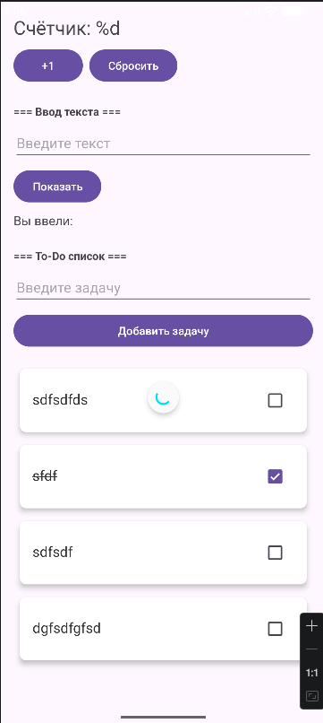

# Лабораторная работа №12

<div align="center">

**МИНИСТЕРСТВО НАУКИ И ВЫСШЕГО ОБРАЗОВАНИЯ РОССИЙСКОЙ ФЕДЕРАЦИИ**  
**ФЕДЕРАЛЬНОЕ ГОСУДАРСТВЕННОЕ БЮДЖЕТНОЕ ОБРАЗОВАТЕЛЬНОЕ УЧРЕЖДЕНИЕ ВЫСШЕГО ОБРАЗОВАНИЯ**  
**«САХАЛИНСКИЙ ГОСУДАРСТВЕННЫЙ УНИВЕРСИТЕТ»**

<br>
<br>

Институт естественных наук и техносферной безопасности  
Кафедра информатики  
**Пахомов Владимир Романович**

<br>
<br>
<br>
<br>

Лабораторная работа №12  
**Выполнение длительных операций (симуляция загрузки) с использованием viewModelScope**  
01.03.02 Прикладная математика и информатика  
3 Курс

<br>
<br>
<br>
<br>
<br>
<br>
<br>
<br>
<br>
<br>
<br>
<br>
<br>

<div align="right">
Научный руководитель<br>
Соболев Евгений Игоревич
</div>

<br>
<br>
<br>

г. Южно-Сахалинск  
2026 г.

</div>

## Цель работы

Научиться выполнять длительные операции в фоновом потоке с использованием корутин и `viewModelScope`, управлять состоянием загрузки в UI, реализовать имитацию загрузки данных и обработку ошибок.

## Индивидуальное задание: Pull-to-Refresh

Добавлен SwipeRefreshLayout для обновления списка задач. При свайпе вниз вызывается метод `refresh()` во ViewModel, который перезагружает данные с отображением индикатора обновления. Это позволяет пользователю вручную обновлять список, не дожидаясь автоматической перезагрузки.

## Скриншоты







## Листинги

### 1. TasksUiState.kt

```kotlin
package com.example.todoapp.ui.theme

import com.example.todoapp.database.TaskEntity

sealed class TasksUiState {
    object Loading : TasksUiState()
    data class Success(val tasks: List<TaskEntity>) : TasksUiState()
    data class Error(val message: String) : TasksUiState()
}
```

### 2. TaskRepository.kt

```kotlin
package com.example.todoapp.data.repository

import com.example.todoapp.database.TaskEntity
import kotlinx.coroutines.flow.Flow

interface TaskRepository {
    fun getAllTasks(): Flow<List<TaskEntity>>
    suspend fun addTask(title: String)
    suspend fun deleteTask(task: TaskEntity)
    suspend fun updateTask(task: TaskEntity)
    suspend fun toggleTaskCompletion(task: TaskEntity, isCompleted: Boolean)
    suspend fun deleteAllTasks()

    suspend fun getTasksOnce(): List<TaskEntity>
}
```

### 3. TaskRepositoryImpl.kt

```kotlin
package com.example.todoapp.data.repository

import com.example.todoapp.database.TaskDao
import com.example.todoapp.database.TaskEntity
import kotlinx.coroutines.flow.Flow
import kotlinx.coroutines.flow.first

class TaskRepositoryImpl(
    private val taskDao: TaskDao
) : TaskRepository {

    override fun getAllTasks(): Flow<List<TaskEntity>> = taskDao.getAllTasks()

    override suspend fun addTask(title: String) {
        val task = TaskEntity(title = title)
        taskDao.insertTask(task)
    }

    override suspend fun deleteTask(task: TaskEntity) {
        taskDao.deleteTask(task)
    }

    override suspend fun updateTask(task: TaskEntity) {
        taskDao.updateTask(task)
    }

    override suspend fun toggleTaskCompletion(task: TaskEntity, isCompleted: Boolean) {
        val updatedTask = task.copy(isCompleted = isCompleted)
        taskDao.updateTask(updatedTask)
    }

    override suspend fun deleteAllTasks() {
        taskDao.deleteAll()
    }

    override suspend fun getTasksOnce(): List<TaskEntity> {
        return taskDao.getAllTasks().first()
    }
}
```

### 4. MainViewModel.kt

```kotlin
package com.example.todoapp.ui.theme

import androidx.lifecycle.ViewModel
import androidx.lifecycle.viewModelScope
import com.example.todoapp.data.repository.TaskRepository
import com.example.todoapp.database.TaskEntity
import com.example.todoapp.ui.theme.TasksUiState
import kotlinx.coroutines.delay
import kotlinx.coroutines.flow.MutableStateFlow
import kotlinx.coroutines.flow.StateFlow
import kotlinx.coroutines.flow.asStateFlow
import kotlinx.coroutines.launch

class MainViewModel(
    private val repository: TaskRepository
) : ViewModel() {

    private val _uiState = MutableStateFlow<TasksUiState>(TasksUiState.Loading)
    val uiState: StateFlow<TasksUiState> = _uiState.asStateFlow()

    init {
        loadTasks()
    }

    fun loadTasks() {
        viewModelScope.launch {
            _uiState.value = TasksUiState.Loading
            try {
                delay(1500) // имитация длительной загрузки
                val tasks = repository.getTasksOnce()
                _uiState.value = TasksUiState.Success(tasks)
            } catch (e: Exception) {
                _uiState.value = TasksUiState.Error(e.message ?: "Ошибка загрузки")
            }
        }
    }

    fun addTask(title: String) {
        viewModelScope.launch {
            repository.addTask(title)
            loadTasks()
        }
    }

    fun deleteTask(task: TaskEntity) {
        viewModelScope.launch {
            repository.deleteTask(task)
            loadTasks()
        }
    }

    fun toggleTaskCompletion(task: TaskEntity, isCompleted: Boolean) {
        viewModelScope.launch {
            repository.toggleTaskCompletion(task, isCompleted)
            loadTasks()
        }
    }

    fun refresh() {
        loadTasks()
    }
}
```

### 5. activity_main.xml

```xml
<?xml version="1.0" encoding="utf-8"?>
<LinearLayout
    xmlns:android="http://schemas.android.com/apk/res/android"
    xmlns:app="http://schemas.android.com/apk/res-auto"
    android:layout_width="match_parent"
    android:layout_height="match_parent"
    android:orientation="vertical"
    android:padding="16dp">

    <TextView
        android:id="@+id/textCounter"
        android:layout_width="wrap_content"
        android:layout_height="wrap_content"
        android:text="@string/counter_text"
        android:textSize="24sp"
        android:layout_marginBottom="8dp"/>

    <LinearLayout
        android:layout_width="wrap_content"
        android:layout_height="wrap_content"
        android:orientation="horizontal"
        android:layout_marginBottom="24dp">

        <Button
            android:id="@+id/buttonIncrement"
            android:layout_width="wrap_content"
            android:layout_height="wrap_content"
            android:text="@string/button_increment"
            android:layout_marginEnd="8dp"/>

        <Button
            android:id="@+id/buttonReset"
            android:layout_width="wrap_content"
            android:layout_height="wrap_content"
            android:text="@string/button_reset"/>
    </LinearLayout>

    <TextView
        android:layout_width="wrap_content"
        android:layout_height="wrap_content"
        android:text="=== Ввод текста ==="
        android:textStyle="bold"
        android:layout_marginBottom="8dp"/>

    <EditText
        android:id="@+id/editTextInput"
        android:layout_width="match_parent"
        android:layout_height="wrap_content"
        android:inputType="text"
        android:hint="@string/hint_input"
        android:layout_marginBottom="8dp"/>

    <Button
        android:id="@+id/buttonShow"
        android:layout_width="wrap_content"
        android:layout_height="wrap_content"
        android:text="@string/button_show"
        android:layout_marginBottom="8dp"/>

    <TextView
        android:id="@+id/textEntered"
        android:layout_width="wrap_content"
        android:layout_height="wrap_content"
        android:text="@string/label_entered"
        android:textSize="16sp"
        android:layout_marginBottom="24dp"/>

    <TextView
        android:layout_width="wrap_content"
        android:layout_height="wrap_content"
        android:text="=== To-Do список ==="
        android:textStyle="bold"
        android:layout_marginBottom="8dp"/>

    <EditText
        android:id="@+id/editTextTask"
        android:layout_width="match_parent"
        android:layout_height="wrap_content"
        android:hint="Введите задачу"
        android:inputType="text"
        android:layout_marginBottom="8dp"/>

    <Button
        android:id="@+id/buttonAddTask"
        android:layout_width="match_parent"
        android:layout_height="wrap_content"
        android:text="@string/button_add_task"
        android:layout_marginBottom="16dp"/>

    <!-- SwipeRefreshLayout для Pull-to-Refresh (индивидуальное задание) -->
    <androidx.swiperefreshlayout.widget.SwipeRefreshLayout
        android:id="@+id/swipeRefreshLayout"
        android:layout_width="match_parent"
        android:layout_height="match_parent">

        <FrameLayout
            android:layout_width="match_parent"
            android:layout_height="match_parent">

            <androidx.recyclerview.widget.RecyclerView
                android:id="@+id/recyclerViewTasks"
                android:layout_width="match_parent"
                android:layout_height="match_parent"
                android:visibility="gone"/>

            <ProgressBar
                android:id="@+id/progressBar"
                android:layout_width="wrap_content"
                android:layout_height="wrap_content"
                android:layout_gravity="center"
                android:visibility="gone"/>

            <TextView
                android:id="@+id/textError"
                android:layout_width="wrap_content"
                android:layout_height="wrap_content"
                android:layout_gravity="center"
                android:text="Ошибка загрузки"
                android:visibility="gone"
                android:textColor="@android:color/holo_red_dark"/>

        </FrameLayout>

    </androidx.swiperefreshlayout.widget.SwipeRefreshLayout>

</LinearLayout>
```

### 6. MainActivity.kt

```kotlin
package com.example.todoapp

import android.content.Intent
import android.os.Bundle
import android.widget.Button
import android.widget.EditText
import android.widget.ProgressBar
import android.widget.TextView
import android.widget.Toast
import androidx.activity.viewModels
import androidx.appcompat.app.AppCompatActivity
import androidx.lifecycle.Lifecycle
import androidx.lifecycle.lifecycleScope
import androidx.lifecycle.repeatOnLifecycle
import androidx.recyclerview.widget.LinearLayoutManager
import androidx.recyclerview.widget.RecyclerView
import androidx.swiperefreshlayout.widget.SwipeRefreshLayout
import com.example.todoapp.data.repository.TaskRepositoryImpl
import com.example.todoapp.database.AppDatabase
import com.example.todoapp.ui.theme.TasksUiState
import com.example.todoapp.ui.theme.MainViewModel
import kotlinx.coroutines.launch

class MainActivity : AppCompatActivity() {

    private val database by lazy { AppDatabase.getInstance(this) }
    private val repository by lazy { TaskRepositoryImpl(database.taskDao()) }
    private val viewModel: MainViewModel by viewModels {
        MainViewModelFactory(repository)
    }

    private lateinit var adapter: TaskAdapter
    private lateinit var textCounter: TextView
    private lateinit var textEntered: TextView
    private lateinit var recyclerView: RecyclerView
    private lateinit var progressBar: ProgressBar
    private lateinit var textError: TextView
    private lateinit var swipeRefreshLayout: SwipeRefreshLayout
    private var counter = 0

    override fun onCreate(savedInstanceState: Bundle?) {
        super.onCreate(savedInstanceState)
        setContentView(R.layout.activity_main)

        textCounter = findViewById(R.id.textCounter)
        textEntered = findViewById(R.id.textEntered)
        val buttonIncrement = findViewById<Button>(R.id.buttonIncrement)
        val buttonReset = findViewById<Button>(R.id.buttonReset)
        val editTextInput = findViewById<EditText>(R.id.editTextInput)
        val buttonShow = findViewById<Button>(R.id.buttonShow)
        val editTextTask = findViewById<EditText>(R.id.editTextTask)
        val buttonAddTask = findViewById<Button>(R.id.buttonAddTask)
        recyclerView = findViewById(R.id.recyclerViewTasks)
        progressBar = findViewById(R.id.progressBar)
        textError = findViewById(R.id.textError)
        swipeRefreshLayout = findViewById(R.id.swipeRefreshLayout)

        setupRecyclerView()
        observeUiState()
        setupSwipeRefresh()

        buttonIncrement.setOnClickListener {
            counter++
            updateCounterDisplay()
        }

        buttonReset.setOnClickListener {
            counter = 0
            updateCounterDisplay()
        }

        buttonShow.setOnClickListener {
            val inputText = editTextInput.text.toString()
            if (inputText.isNotBlank()) {
                textEntered.text = "${getString(R.string.label_entered)} $inputText"
                editTextInput.text.clear()
            } else {
                Toast.makeText(this, "Введите текст", Toast.LENGTH_SHORT).show()
            }
        }

        buttonAddTask.setOnClickListener {
            val task = editTextTask.text.toString()
            if (task.isNotBlank()) {
                viewModel.addTask(task)
                editTextTask.text.clear()
            } else {
                Toast.makeText(this, "Введите задачу", Toast.LENGTH_SHORT).show()
            }
        }

        if (savedInstanceState != null) {
            counter = savedInstanceState.getInt("counter", 0)
            updateCounterDisplay()
        }
    }

    private fun setupRecyclerView() {
        adapter = TaskAdapter(
            tasks = emptyList(),
            onItemClick = { task ->
                val intent = Intent(this, DetailActivity::class.java)
                intent.putExtra("task_text", task.title)
                startActivity(intent)
            },
            onItemLongClick = { task ->
                viewModel.deleteTask(task)
                Toast.makeText(this, "Задача удалена", Toast.LENGTH_SHORT).show()
            },
            onCheckChange = { task, isChecked ->
                viewModel.toggleTaskCompletion(task, isChecked)
            }
        )
        recyclerView.layoutManager = LinearLayoutManager(this)
        recyclerView.adapter = adapter
    }

    private fun observeUiState() {
        lifecycleScope.launch {
            repeatOnLifecycle(Lifecycle.State.STARTED) {
                viewModel.uiState.collect { state ->
                    when (state) {
                        is TasksUiState.Loading -> {
                            if (!swipeRefreshLayout.isRefreshing) {
                                recyclerView.visibility = android.view.View.GONE
                                progressBar.visibility = android.view.View.VISIBLE
                                textError.visibility = android.view.View.GONE
                            }
                        }
                        is TasksUiState.Success -> {
                            swipeRefreshLayout.isRefreshing = false
                            recyclerView.visibility = android.view.View.VISIBLE
                            progressBar.visibility = android.view.View.GONE
                            textError.visibility = android.view.View.GONE
                            adapter.updateData(state.tasks)
                        }
                        is TasksUiState.Error -> {
                            swipeRefreshLayout.isRefreshing = false
                            recyclerView.visibility = android.view.View.GONE
                            progressBar.visibility = android.view.View.GONE
                            textError.visibility = android.view.View.VISIBLE
                            textError.text = state.message
                        }
                    }
                }
            }
        }
    }

    private fun setupSwipeRefresh() {
        swipeRefreshLayout.setOnRefreshListener {
            viewModel.refresh()
        }
        swipeRefreshLayout.setColorSchemeResources(
            android.R.color.holo_blue_bright,
            android.R.color.holo_green_light,
            android.R.color.holo_orange_light,
            android.R.color.holo_red_light
        )
    }

    private fun updateCounterDisplay() {
        textCounter.text = getString(R.string.counter_text, counter)
    }

    override fun onSaveInstanceState(outState: Bundle) {
        super.onSaveInstanceState(outState)
        outState.putInt("counter", counter)
    }


}
```

## Ответы на контрольные вопросы

**1. Почему длительные операции нельзя выполнять в главном потоке?**

Выполнение длительных операций в главном потоке блокирует UI-поток, что приводит к зависанию интерфейса. Если главный поток заблокирован более чем на 5 секунд, Android выбрасывает исключение `Application Not Responding` (ANR). Пользователь не может взаимодействовать с приложением.

**2. Что такое `viewModelScope` и как он связан с жизненным циклом ViewModel?**

`viewModelScope` — это встроенная область корутин, привязанная к жизненному циклу ViewModel. Все корутины, запущенные в этом скоупе, автоматически отменяются при уничтожении ViewModel (например, при закрытии Activity или фрагмента). Это предотвращает утечки памяти и ненужную фоновую работу.

**3. Какие преимущества даёт использование sealed class для представления состояний UI?**

Sealed class позволяет явно описать все возможные состояния экрана (загрузка, успех, ошибка). Компилятор проверяет, что все ветки `when` обработаны. Это делает код безопаснее и читаемее, исключает появление неожиданных состояний.

**4. Как имитировать задержку в корутине?**

Используется функция `delay(milliseconds)` из библиотеки `kotlinx.coroutines`. Она приостанавливает выполнение корутины на указанное время без блокировки потока. В работе используется `delay(1500)` для имитации загрузки данных.

**5. Как обрабатывать ошибки при выполнении корутин?**

Ошибки обрабатываются с помощью стандартного блока `try-catch` внутри корутины. При возникновении исключения можно отправить в UI состояние `Error` с сообщением об ошибке. Важно обрабатывать ошибки на уровне каждого `launch` или использовать `CoroutineExceptionHandler`.

## Вывод

В ходе выполнения лабораторной работы №12 приложение `TodoApp` было дополнено управлением состояниями загрузки и обработкой длительных операций.

В процессе работы были изучены и применены на практике:
- **`viewModelScope`** — для запуска корутин, привязанных к жизненному циклу ViewModel
- **Sealed class `TasksUiState`** — для описания трёх состояний экрана (Loading, Success, Error)
- **`delay()`** — для имитации длительной операции (например, сетевого запроса)
- **`try-catch`** — для обработки ошибок при выполнении корутин
- **SwipeRefreshLayout** — для реализации Pull-to-Refresh (индивидуальное задание)