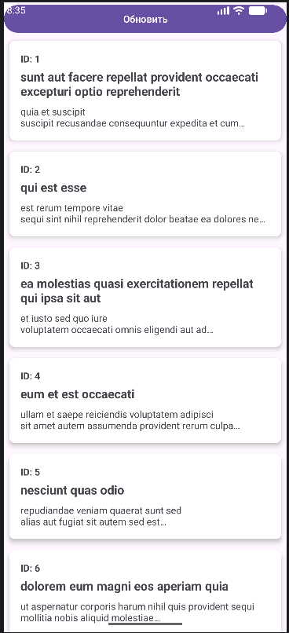
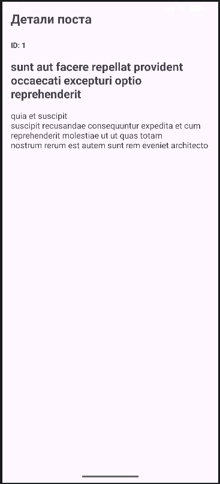
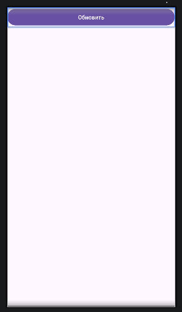

# Лабораторная работа №13

<div align="center">

**МИНИСТЕРСТВО НАУКИ И ВЫСШЕГО ОБРАЗОВАНИЯ РОССИЙСКОЙ ФЕДЕРАЦИИ**  
**ФЕДЕРАЛЬНОЕ ГОСУДАРСТВЕННОЕ БЮДЖЕТНОЕ ОБРАЗОВАТЕЛЬНОЕ УЧРЕЖДЕНИЕ ВЫСШЕГО ОБРАЗОВАНИЯ**  
**«САХАЛИНСКИЙ ГОСУДАРСТВЕННЫЙ УНИВЕРСИТЕТ»**

<br>
<br>

Институт естественных наук и техносферной безопасности  
Кафедра информатики  
**Пахомов Владимир Романович**

<br>
<br>
<br>
<br>

Лабораторная работа №13  
**Создание простого API клиента. Запрос списка постов с jsonplaceholder.typicode.com**  
01.03.02 Прикладная математика и информатика  
3 Курс

<br>
<br>
<br>
<br>
<br>
<br>
<br>
<br>
<br>
<br>
<br>
<br>
<br>

<div align="right">
Научный руководитель<br>
Соболев Евгений Игоревич
</div>

<br>
<br>
<br>

г. Южно-Сахалинск  
2026 г.

</div>

## Цель работы

Научиться выполнять сетевые запросы в Android-приложении с использованием библиотеки Retrofit и корутин, обрабатывать ответы сервера, парсить JSON-данные и отображать их в RecyclerView.

## Индивидуальное задание: Детальный экран поста

При клике на элемент списка открывается новый экран (DetailActivity) с полной информацией о посте: ID, заголовок и текст. Данные передаются через Intent с помощью putExtra().

## Скриншоты

  

<br>

  

<br>

  

## Листинги

### 1. build.gradle.kts

```kotlin
plugins {
    alias(libs.plugins.android.application)
}

android {
    namespace = "com.example.postsapp"
    compileSdk {
        version = release(36) {
            minorApiLevel = 1
        }
    }

    defaultConfig {
        applicationId = "com.example.postsapp"
        minSdk = 24
        targetSdk = 36
        versionCode = 1
        versionName = "1.0"

        testInstrumentationRunner = "androidx.test.runner.AndroidJUnitRunner"
    }

    buildTypes {
        release {
            isMinifyEnabled = false
            proguardFiles(
                getDefaultProguardFile("proguard-android-optimize.txt"),
                "proguard-rules.pro"
            )
        }
    }
    compileOptions {
        sourceCompatibility = JavaVersion.VERSION_11
        targetCompatibility = JavaVersion.VERSION_11
    }
    buildFeatures {
        viewBinding = true
    }
}

dependencies {
    implementation(libs.androidx.core.ktx)
    implementation(libs.androidx.appcompat)
    implementation(libs.material)
    implementation(libs.androidx.activity)
    implementation(libs.androidx.constraintlayout)
    testImplementation(libs.junit)
    androidTestImplementation(libs.androidx.junit)
    androidTestImplementation(libs.androidx.espresso.core)

    implementation("androidx.recyclerview:recyclerview:1.3.2")
    implementation("androidx.cardview:cardview:1.0.0")
    implementation("com.squareup.retrofit2:retrofit:2.9.0")
    implementation("com.squareup.retrofit2:converter-gson:2.9.0")
    implementation("org.jetbrains.kotlinx:kotlinx-coroutines-android:1.7.3")
    implementation("androidx.lifecycle:lifecycle-viewmodel-ktx:2.7.0")
    implementation("androidx.lifecycle:lifecycle-runtime-ktx:2.7.0")
}
```

### 2. AndroidManifest.xml

```xml
<?xml version="1.0" encoding="utf-8"?>
<manifest xmlns:android="http://schemas.android.com/apk/res/android"
    package="com.example.postsapp">

    <uses-permission android:name="android.permission.INTERNET" />

    <application
        android:allowBackup="true"
        android:icon="@mipmap/ic_launcher"
        android:label="@string/app_name"
        android:roundIcon="@mipmap/ic_launcher_round"
        android:supportsRtl="true"
        android:theme="@style/Theme.PostsApp">
        
        <activity
            android:name=".MainActivity"
            android:exported="true">
            <intent-filter>
                <action android:name="android.intent.action.MAIN" />
                <category android:name="android.intent.category.LAUNCHER" />
            </intent-filter>
        </activity>
        
        <activity android:name=".DetailActivity" />
        
    </application>

</manifest>
```

### 3. activity_main.xml

```xml
<?xml version="1.0" encoding="utf-8"?>
<LinearLayout
    xmlns:android="http://schemas.android.com/apk/res/android"
    android:layout_width="match_parent"
    android:layout_height="match_parent"
    android:orientation="vertical">

    <Button
        android:id="@+id/buttonRefresh"
        android:layout_width="match_parent"
        android:layout_height="wrap_content"
        android:text="Обновить"/>

    <FrameLayout
        android:layout_width="match_parent"
        android:layout_height="match_parent">

        <androidx.recyclerview.widget.RecyclerView
            android:id="@+id/recyclerViewPosts"
            android:layout_width="match_parent"
            android:layout_height="match_parent"
            android:visibility="gone"/>

        <ProgressBar
            android:id="@+id/progressBar"
            android:layout_width="wrap_content"
            android:layout_height="wrap_content"
            android:layout_gravity="center"
            android:visibility="gone"/>

        <TextView
            android:id="@+id/textError"
            android:layout_width="wrap_content"
            android:layout_height="wrap_content"
            android:layout_gravity="center"
            android:text="Ошибка загрузки"
            android:visibility="gone"/>

    </FrameLayout>

</LinearLayout>
```

### 4. activity_detail.xml

```xml
<?xml version="1.0" encoding="utf-8"?>
<LinearLayout
    xmlns:android="http://schemas.android.com/apk/res/android"
    android:layout_width="match_parent"
    android:layout_height="match_parent"
    android:orientation="vertical"
    android:padding="16dp">

    <TextView
        android:layout_width="wrap_content"
        android:layout_height="wrap_content"
        android:text="Детали поста"
        android:textSize="24sp"
        android:textStyle="bold"
        android:layout_marginBottom="24dp"/>

    <TextView
        android:id="@+id/textDetailId"
        android:layout_width="wrap_content"
        android:layout_height="wrap_content"
        android:textSize="14sp"
        android:textStyle="bold"
        android:layout_marginBottom="16dp"/>

    <TextView
        android:id="@+id/textDetailTitle"
        android:layout_width="match_parent"
        android:layout_height="wrap_content"
        android:textSize="22sp"
        android:textStyle="bold"
        android:layout_marginBottom="16dp"/>

    <TextView
        android:id="@+id/textDetailBody"
        android:layout_width="match_parent"
        android:layout_height="wrap_content"
        android:textSize="16sp"/>

</LinearLayout>
```

### 5. item_post.xml

```xml
<?xml version="1.0" encoding="utf-8"?>
<androidx.cardview.widget.CardView
    xmlns:android="http://schemas.android.com/apk/res/android"
    xmlns:app="http://schemas.android.com/apk/res-auto"
    android:layout_width="match_parent"
    android:layout_height="wrap_content"
    android:layout_margin="8dp"
    app:cardCornerRadius="8dp"
    app:cardElevation="4dp">

    <LinearLayout
        android:layout_width="match_parent"
        android:layout_height="wrap_content"
        android:orientation="vertical"
        android:padding="16dp">

        <TextView
            android:id="@+id/textPostId"
            android:layout_width="wrap_content"
            android:layout_height="wrap_content"
            android:textSize="14sp"
            android:textStyle="bold"/>

        <TextView
            android:id="@+id/textPostTitle"
            android:layout_width="match_parent"
            android:layout_height="wrap_content"
            android:textSize="18sp"
            android:textStyle="bold"
            android:layout_marginTop="4dp"/>

        <TextView
            android:id="@+id/textPostBody"
            android:layout_width="match_parent"
            android:layout_height="wrap_content"
            android:textSize="14sp"
            android:layout_marginTop="8dp"
            android:maxLines="2"
            android:ellipsize="end"/>

    </LinearLayout>

</androidx.cardview.widget.CardView>
```

### 6. Post.kt

```kotlin
package com.example.postsapp.models

data class Post(
    val id: Int,
    val title: String,
    val body: String
)
```

### 7. ApiService.kt

```kotlin
package com.example.postsapp.api

import com.example.postsapp.models.Post
import retrofit2.http.GET

interface ApiService {
    @GET("posts")
    suspend fun getPosts(): List<Post>
}
```

### 8. RetrofitClient.kt

```kotlin
package com.example.postsapp.api

import retrofit2.Retrofit
import retrofit2.converter.gson.GsonConverterFactory

object RetrofitClient {
    private const val BASE_URL = "https://jsonplaceholder.typicode.com/"

    private val retrofit = Retrofit.Builder()
        .baseUrl(BASE_URL)
        .addConverterFactory(GsonConverterFactory.create())
        .build()

    val apiService: ApiService = retrofit.create(ApiService::class.java)
}
```

### 9. PostsRepository.kt

```kotlin
package com.example.postsapp.repositories

import com.example.postsapp.api.RetrofitClient
import com.example.postsapp.models.Post
import kotlinx.coroutines.Dispatchers
import kotlinx.coroutines.withContext

class PostsRepository {
    private val apiService = RetrofitClient.apiService

    suspend fun getPosts(): List<Post> = withContext(Dispatchers.IO) {
        apiService.getPosts()
    }
}
```

### 10. PostsUiState.kt

```kotlin
package com.example.postsapp.viewmodels

import com.example.postsapp.models.Post

sealed class PostsUiState {
    object Loading : PostsUiState()
    data class Success(val posts: List<Post>) : PostsUiState()
    data class Error(val message: String) : PostsUiState()
}
```

### 11. PostsViewModel.kt

```kotlin
package com.example.postsapp.viewmodels

import androidx.lifecycle.ViewModel
import androidx.lifecycle.viewModelScope
import com.example.postsapp.models.Post
import com.example.postsapp.repositories.PostsRepository
import kotlinx.coroutines.flow.MutableStateFlow
import kotlinx.coroutines.flow.StateFlow
import kotlinx.coroutines.flow.asStateFlow
import kotlinx.coroutines.launch

class PostsViewModel : ViewModel() {
    private val repository = PostsRepository()
    
    private val _uiState = MutableStateFlow<PostsUiState>(PostsUiState.Loading)
    val uiState: StateFlow<PostsUiState> = _uiState.asStateFlow()

    init {
        loadPosts()
    }

    fun loadPosts() {
        viewModelScope.launch {
            _uiState.value = PostsUiState.Loading
            try {
                val posts = repository.getPosts()
                _uiState.value = PostsUiState.Success(posts)
            } catch (e: Exception) {
                _uiState.value = PostsUiState.Error(e.message ?: "Unknown error")
            }
        }
    }
}
```

### 12. PostsAdapter.kt

```kotlin
package com.example.postsapp.adapters

import android.view.LayoutInflater
import android.view.ViewGroup
import androidx.recyclerview.widget.RecyclerView
import com.example.postsapp.databinding.ItemPostBinding
import com.example.postsapp.models.Post

class PostsAdapter(
    private val onItemClick: (Post) -> Unit
) : RecyclerView.Adapter<PostsAdapter.PostViewHolder>() {
    
    private var posts = emptyList<Post>()
    
    fun submitList(newPosts: List<Post>) {
        posts = newPosts
        notifyDataSetChanged()
    }
    
    override fun onCreateViewHolder(parent: ViewGroup, viewType: Int): PostViewHolder {
        val binding = ItemPostBinding.inflate(LayoutInflater.from(parent.context), parent, false)
        return PostViewHolder(binding)
    }
    
    override fun onBindViewHolder(holder: PostViewHolder, position: Int) {
        holder.bind(posts[position])
    }
    
    override fun getItemCount() = posts.size
    
    inner class PostViewHolder(private val binding: ItemPostBinding) : 
        RecyclerView.ViewHolder(binding.root) {
        
        fun bind(post: Post) {
            binding.textPostId.text = "ID: ${post.id}"
            binding.textPostTitle.text = post.title
            binding.textPostBody.text = post.body
            
            binding.root.setOnClickListener {
                onItemClick(post)
            }
        }
    }
}
```

### 13. MainActivity.kt

```kotlin
package com.example.postsapp

import android.content.Intent
import android.os.Bundle
import android.widget.Button
import android.widget.ProgressBar
import android.widget.TextView
import androidx.activity.viewModels
import androidx.appcompat.app.AppCompatActivity
import androidx.lifecycle.Lifecycle
import androidx.lifecycle.lifecycleScope
import androidx.lifecycle.repeatOnLifecycle
import androidx.recyclerview.widget.LinearLayoutManager
import androidx.recyclerview.widget.RecyclerView
import com.example.postsapp.adapters.PostsAdapter
import com.example.postsapp.viewmodels.PostsUiState
import com.example.postsapp.viewmodels.PostsViewModel
import kotlinx.coroutines.launch

class MainActivity : AppCompatActivity() {

    private val viewModel: PostsViewModel by viewModels()
    private lateinit var adapter: PostsAdapter
    private lateinit var recyclerView: RecyclerView
    private lateinit var progressBar: ProgressBar
    private lateinit var textError: TextView
    private lateinit var buttonRefresh: Button

    override fun onCreate(savedInstanceState: Bundle?) {
        super.onCreate(savedInstanceState)
        setContentView(R.layout.activity_main)

        recyclerView = findViewById(R.id.recyclerViewPosts)
        progressBar = findViewById(R.id.progressBar)
        textError = findViewById(R.id.textError)
        buttonRefresh = findViewById(R.id.buttonRefresh)

        setupRecyclerView()
        observeUiState()

        buttonRefresh.setOnClickListener {
            viewModel.loadPosts()
        }
    }

    private fun setupRecyclerView() {
        adapter = PostsAdapter { post ->
            val intent = Intent(this, DetailActivity::class.java)
            intent.putExtra("post_id", post.id)
            intent.putExtra("post_title", post.title)
            intent.putExtra("post_body", post.body)
            startActivity(intent)
        }
        recyclerView.layoutManager = LinearLayoutManager(this)
        recyclerView.adapter = adapter
    }

    private fun observeUiState() {
        lifecycleScope.launch {
            repeatOnLifecycle(Lifecycle.State.STARTED) {
                viewModel.uiState.collect { state ->
                    when (state) {
                        is PostsUiState.Loading -> showLoading()
                        is PostsUiState.Success -> showPosts(state.posts)
                        is PostsUiState.Error -> showError(state.message)
                    }
                }
            }
        }
    }

    private fun showLoading() {
        recyclerView.visibility = android.view.View.GONE
        progressBar.visibility = android.view.View.VISIBLE
        textError.visibility = android.view.View.GONE
    }

    private fun showPosts(posts: List<Post>) {
        recyclerView.visibility = android.view.View.VISIBLE
        progressBar.visibility = android.view.View.GONE
        textError.visibility = android.view.View.GONE
        adapter.submitList(posts)
    }

    private fun showError(message: String) {
        recyclerView.visibility = android.view.View.GONE
        progressBar.visibility = android.view.View.GONE
        textError.visibility = android.view.View.VISIBLE
        textError.text = "Ошибка: $message"
    }
}
```

### 14. DetailActivity.kt

```kotlin
package com.example.postsapp

import android.os.Bundle
import android.widget.TextView
import androidx.appcompat.app.AppCompatActivity

class DetailActivity : AppCompatActivity() {
    override fun onCreate(savedInstanceState: Bundle?) {
        super.onCreate(savedInstanceState)
        setContentView(R.layout.activity_detail)

        val id = intent.getIntExtra("post_id", 0)
        val title = intent.getStringExtra("post_title") ?: ""
        val body = intent.getStringExtra("post_body") ?: ""

        findViewById<TextView>(R.id.textDetailId).text = "ID: $id"
        findViewById<TextView>(R.id.textDetailTitle).text = title
        findViewById<TextView>(R.id.textDetailBody).text = body
    }
}
```

## Ответы на контрольные вопросы

**1. Для чего используется библиотека Retrofit? Какие аннотации вы знаете?**

Retrofit — это HTTP-клиент для Android и Java, который упрощает выполнение сетевых запросов и преобразование JSON-ответов в Kotlin-объекты. Основные аннотации: `@GET`, `@POST`, `@PUT`, `@DELETE`, `@Path`, `@Query`, `@Body`.

**2. Почему сетевые запросы нельзя выполнять в главном потоке?**

Сетевые запросы могут занимать неопределённое время и блокируют главный поток (UI-поток). Если главный поток заблокирован более чем на 5 секунд, Android выбросит исключение `NetworkOnMainThreadException`. UI перестаёт отвечать на действия пользователя.

**3. Что такое `suspend` функция и как она работает с корутинами?**

`suspend` — это ключевое слово, которое указывает, что функция может приостанавливать выполнение без блокировки потока. Корутины управляют такими функциями: при вызове `suspend` функции корутина приостанавливается, а когда результат готов — возобновляет работу.

**4. Для чего нужен `Dispatchers.IO`?**

`Dispatchers.IO` — это планировщик корутин, оптимизированный для операций ввода-вывода: сетевые запросы, чтение/запись в файлы, работа с базой данных. Он использует пул потоков, подходящий для блокирующих операций.

**5. Как обрабатывать ошибки при сетевых запросах?**

Ошибки обрабатываются с помощью блока `try-catch` внутри корутины. При возникновении исключения (например, нет интернета, сервер недоступен) можно отправить в UI состояние `Error` с сообщением.

**6. Что такое JSONPlaceholder и для чего он используется?**

JSONPlaceholder — это бесплатный тестовый REST API для прототипирования и тестирования. Он предоставляет фейковые данные (посты, комментарии, пользователи и т.д.) и не требует регистрации. В работе используется для получения списка постов.

## Вывод

В ходе выполнения лабораторной работы №13 было создано приложение `PostsApp` для загрузки и отображения списка постов с тестового REST API JSONPlaceholder.

В процессе работы были изучены и применены на практике:
- **Retrofit** — для выполнения сетевых GET-запросов и преобразования JSON в объекты
- **Корутины** — для асинхронного выполнения запросов без блокировки UI
- **ViewModel и StateFlow** — для управления состоянием экрана (загрузка, успех, ошибка)
- **RecyclerView и CardView** — для отображения списка постов в виде карточек
- **Sealed class** — для описания трёх состояний UI (Loading, Success, Error)

Индивидуальное задание **«Детальный экран поста»** выполнено полностью: при клике на пост открывается второй экран с полной информацией (ID, заголовок, текст), данные передаются через Intent.