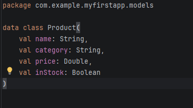
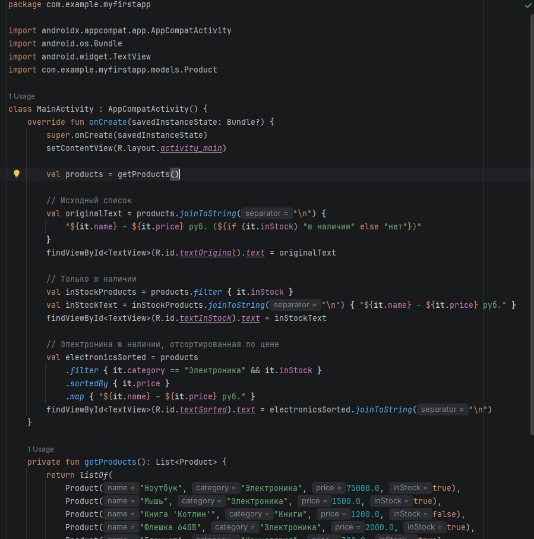
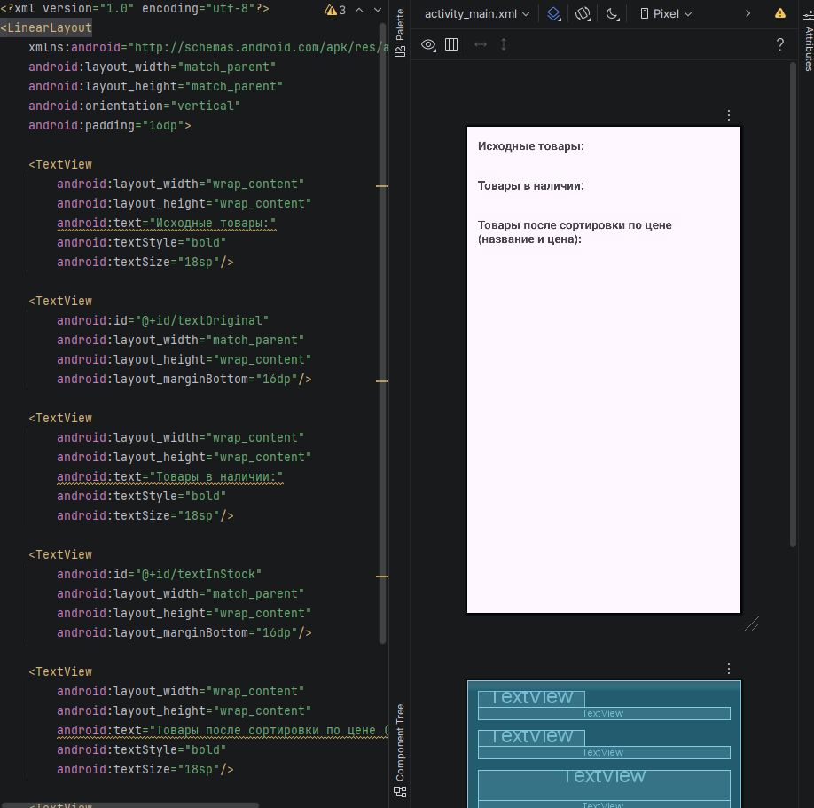
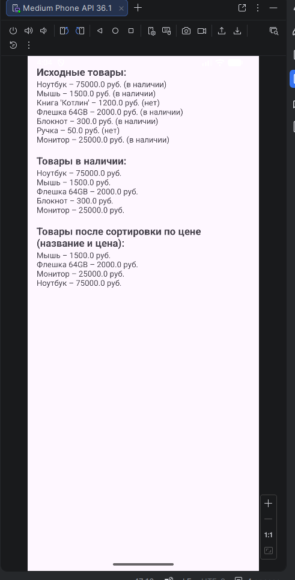
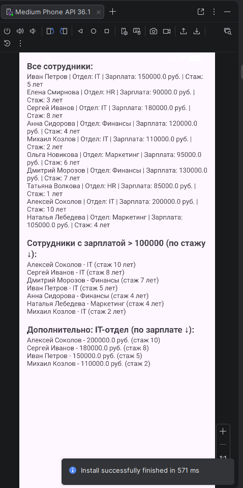

# Лабораторная работа №3

<div align="center">

**МИНИСТЕРСТВО НАУКИ И ВЫСШЕГО ОБРАЗОВАНИЯ РОССИЙСКОЙ ФЕДЕРАЦИИ**  
**ФЕДЕРАЛЬНОЕ ГОСУДАРСТВЕННОЕ БЮДЖЕТНОЕ ОБРАЗОВАТЕЛЬНОЕ УЧРЕЖДЕНИЕ ВЫСШЕГО ОБРАЗОВАНИЯ**  
**«САХАЛИНСКИЙ ГОСУДАРСТВЕННЫЙ УНИВЕРСИТЕТ»**

<br>
<br>

Институт естественных наук и техносферной безопасности  
Кафедра информатики  
**Пахомов Владимир Романович**

<br>
<br>
<br>
<br>

Лабораторная работа №3  
**«Реализация списка объектов с фильтрацией с использованием .map, .filter, .sortedBy»**  
01.03.02 Прикладная математика и информатика  
3 Курс

<br>
<br>
<br>
<br>
<br>
<br>
<br>
<br>
<br>
<br>
<br>
<br>
<br>

<div align="right">
Научный руководитель<br>
Соболев Евгений Игоревич
</div>

<br>
<br>
<br>

г. Южно-Сахалинск  
2026 г.

</div>

---

## Цель Работы +  индивидуальное задание: Список фильмов

Изучить и применить на практике функциональные методы обработки коллекций в Kotlin (`filter`, `map`, `sortedBy`) для фильтрации, сортировки и преобразования данных на примере списка сотрудников с выводом результатов в интерфейс Android-приложения.


## Скриншоты

  

<br>

  

<br>



<br>



<br>




### 1. Класс данных Employee (`Employee.kt`)

```kotlin
package com.example.myfirstapp.models

data class Employee(
    val name: String,
    val department: String,
    val salary: Double,
    val experience: Int
)
```

### 2. Разметка activity_main.xml

```xml
<?xml version="1.0" encoding="utf-8"?>
<ScrollView xmlns:android="http://schemas.android.com/apk/res/android"
    xmlns:tools="http://schemas.android.com/tools"
    android:layout_width="match_parent"
    android:layout_height="match_parent"
    tools:context=".MainActivity">

    <LinearLayout
        android:layout_width="match_parent"
        android:layout_height="wrap_content"
        android:orientation="vertical"
        android:padding="16dp">

        <TextView
            android:layout_width="wrap_content"
            android:layout_height="wrap_content"
            android:text="Все сотрудники:"
            android:textStyle="bold"
            android:textSize="18sp"/>

        <TextView
            android:id="@+id/textOriginal"
            android:layout_width="match_parent"
            android:layout_height="wrap_content"
            android:layout_marginBottom="16dp"/>

        <TextView
            android:layout_width="wrap_content"
            android:layout_height="wrap_content"
            android:text="Сотрудники с зарплатой > 100000 (по стажу ↓):"
            android:textStyle="bold"
            android:textSize="18sp"/>

        <TextView
            android:id="@+id/textFiltered"
            android:layout_width="match_parent"
            android:layout_height="wrap_content"
            android:layout_marginBottom="16dp"/>

        <TextView
            android:layout_width="wrap_content"
            android:layout_height="wrap_content"
            android:text="Дополнительно: IT-отдел (по зарплате ↓):"
            android:textStyle="bold"
            android:textSize="18sp"/>

        <TextView
            android:id="@+id/textAdditional"
            android:layout_width="match_parent"
            android:layout_height="wrap_content"/>

    </LinearLayout>
```

### 3. MainActivity.kt

```kotlin
package com.example.myfirstapp

import android.os.Bundle
import android.widget.TextView
import androidx.appcompat.app.AppCompatActivity
import com.example.myfirstapp.models.Employee

class MainActivity : AppCompatActivity() {

    override fun onCreate(savedInstanceState: Bundle?) {
        super.onCreate(savedInstanceState)
        setContentView(R.layout.activity_main)

        val employees = getEmployees()
        val originalText = employees.joinToString("\n") {
            "${it.name} | Отдел: ${it.department} | Зарплата: ${it.salary} руб. | Стаж: ${it.experience} лет"
        }
        findViewById<TextView>(R.id.textOriginal).text = originalText

        val highSalaryEmployees = employees
            .filter { it.salary > 100000 }
            .sortedByDescending { it.experience }
            .map { "${it.name} - ${it.department} (стаж ${it.experience} лет)" }

        findViewById<TextView>(R.id.textFiltered).text = 
            if (highSalaryEmployees.isNotEmpty()) 
                highSalaryEmployees.joinToString("\n")
            else 
                "Нет сотрудников с зарплатой выше 100000"
        val itDepartment = employees
            .filter { it.department == "IT" }
            .sortedByDescending { it.salary }
            .map { "${it.name} - ${it.salary} руб. (стаж ${it.experience})" }

        findViewById<TextView>(R.id.textAdditional).text = 
            if (itDepartment.isNotEmpty()) 
                itDepartment.joinToString("\n")
            else 
                "Нет сотрудников в IT отделе"
    }

    private fun getEmployees(): List<Employee> {
        return listOf(
            Employee("Иван Петров", "IT", 150000.0, 5),
            Employee("Елена Смирнова", "HR", 90000.0, 3),
            Employee("Сергей Иванов", "IT", 180000.0, 8),
            Employee("Анна Сидорова", "Финансы", 120000.0, 4),
            Employee("Михаил Козлов", "IT", 110000.0, 2),
            Employee("Ольга Новикова", "Маркетинг", 95000.0, 6),
            Employee("Дмитрий Морозов", "Финансы", 130000.0, 7),
            Employee("Татьяна Волкова", "HR", 85000.0, 1),
            Employee("Алексей Соколов", "IT", 200000.0, 10),
            Employee("Наталья Лебедева", "Маркетинг", 105000.0, 4)
        )
    }
}
```

## Ответы на контрольные вопросы

**1. Что возвращает функция `filter` – новый список или изменяет существующий?**

Функция `filter` всегда возвращает **новый список**, содержащий только те элементы исходной коллекции, которые удовлетворяют заданному условию. Исходный список при этом остаётся неизменным. Например, при фильтрации сотрудников с зарплатой выше 100000 рублей создаётся новый список, а все данные о сотрудниках сохраняются в первоначальном виде.

**2. В чём разница между `sortedBy` и `sortedByDescending`?**

Разница заключается в направлении сортировки:
- `sortedBy` выполняет сортировку **по возрастанию** (от меньшего к большему) — например, сотрудники с меньшим стажем будут первыми
- `sortedByDescending` выполняет сортировку **по убыванию** (от большего к меньшему) — например, сотрудники с большим стажем будут первыми, что и требовалось в индивидуальном задании

**3. Как можно объединить несколько условий в `filter`?**

Для объединения нескольких условий используются логические операторы:
- **`&&` (логическое И)** — все условия должны выполняться одновременно
- **`||` (логическое ИЛИ)** — достаточно выполнения хотя бы одного условия

**Пример:** `filter { it.salary > 100000 && it.department == "IT" }` вернёт только сотрудников IT-отдела с зарплатой выше 100000 рублей.

**4. Для чего используется функция `map`? Приведите пример.**

Функция `map` применяется для **преобразования** каждого элемента коллекции в другой вид или формат. Она возвращает новый список с преобразованными элементами. 

**5. Что такое `joinToString` и как она работает?**

`joinToString` — это функция, которая **объединяет элементы коллекции в единую строку** с указанным разделителем. Она позволяет гибко настраивать форматирование: можно задать разделитель (запятая, пробел, перенос строки), префикс, суффикс, а также ограничить количество элементов. 

В лабораторной работе используется `joinToString("\n")`, где в качестве разделителя указан символ переноса строки, благодаря чему каждый элемент списка отображается с новой строки в компоненте `TextView`.

## Вывод

В ходе выполнения лабораторной работы было создано Android-приложение, демонстрирующее практическое применение функциональных методов обработки коллекций в Kotlin на примере списка сотрудников.

В процессе работы были изучены и успешно применены следующие функции:

- **`filter`** – для отбора сотрудников с заработной платой выше 100000 рублей в соответствии с индивидуальным заданием
- **`sortedByDescending`** – для сортировки отобранных сотрудников по убыванию стажа работы
- **`map`** – для преобразования объектов `Employee` в форматированные строки, содержащие только имя сотрудника и название его отдела
- **Цепочки вызовов** – для последовательного применения нескольких операций обработки данных
- **`joinToString`** – для корректного отображения списков в компонентах `TextView` с разделением элементов переносом строки

Для реализации индивидуального задания **«Список сотрудников»** был создан data class `Employee` с необходимыми полями: имя, отдел, зарплата, стаж. Сформирован тестовый набор данных из 10 сотрудников с различными отделами, уровнями зарплаты и стажем работы.

В интерфейсе приложения реализовано три блока вывода:
1. **Все сотрудники** – исходный список для наглядного сравнения
2. **Сотрудники с зарплатой выше 100000 (отсортированные по стажу)** – прямое выполнение индивидуального задания с использованием цепочки `filter` → `sortedByDescending` → `map`
3. **Дополнительный пример: IT-отдел (по убыванию зарплаты)** – демонстрирует возможность применения изученных методов для решения других задач фильтрации и сортировки

Приложение успешно функционирует на эмуляторе, все три списка отображаются корректно, что подтверждает правильность реализации функциональной обработки коллекций. Фильтрация оставляет только сотрудников с зарплатой выше 100000 рублей, сортировка правильно располагает их по убыванию стажа (от наиболее опытных к менее опытным), а преобразование `map` формирует читаемые строки с именами и отделами.