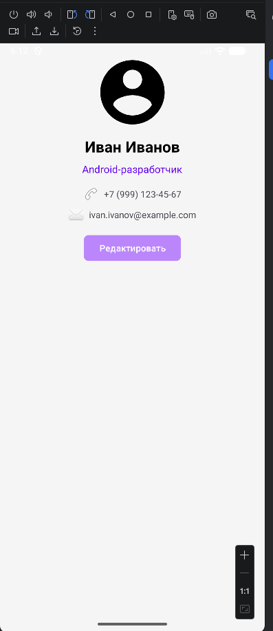
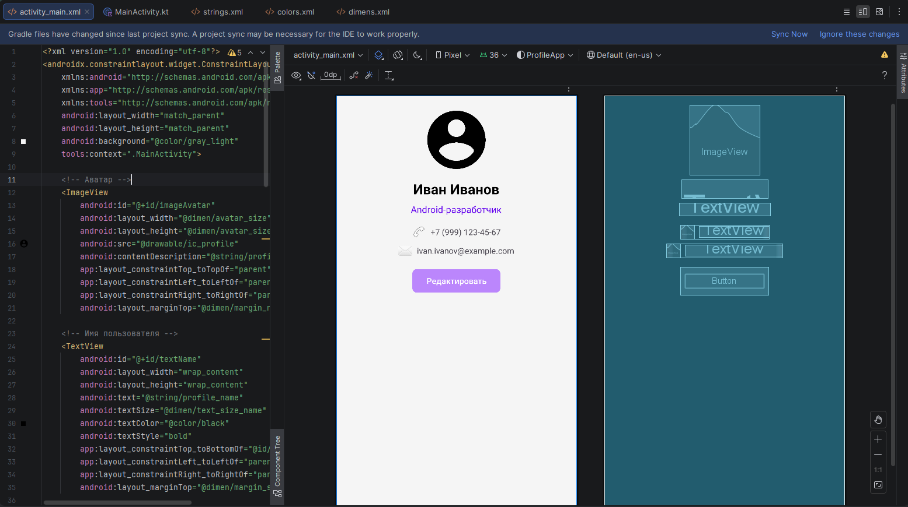
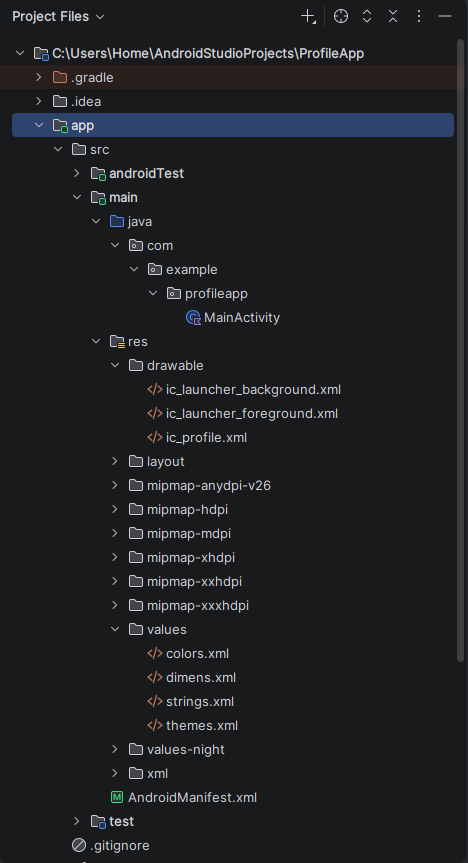

# Лабораторная работа №4

<div align="center">

**МИНИСТЕРСТВО НАУКИ И ВЫСШЕГО ОБРАЗОВАНИЯ РОССИЙСКОЙ ФЕДЕРАЦИИ**  
**ФЕДЕРАЛЬНОЕ ГОСУДАРСТВЕННОЕ БЮДЖЕТНОЕ ОБРАЗОВАТЕЛЬНОЕ УЧРЕЖДЕНИЕ ВЫСШЕГО ОБРАЗОВАНИЯ**  
**«САХАЛИНСКИЙ ГОСУДАРСТВЕННЫЙ УНИВЕРСИТЕТ»**

<br>
<br>

Институт естественных наук и техносферной безопасности  
Кафедра информатики  
**Пахомов Владимир Романович**

<br>
<br>
<br>
<br>

Лабораторная работа №4  
**Верстка экрана профиля пользователя (аватар, имя, кнопка «Редактировать»)**  
01.03.02 Прикладная математика и информатика  
3 Курс

<br>
<br>
<br>
<br>
<br>
<br>
<br>
<br>
<br>
<br>
<br>
<br>
<br>

<div align="right">
Научный руководитель<br>
Соболев Евгений Игоревич
</div>

<br>
<br>
<br>

г. Южно-Сахалинск  
2026 г.

</div>

## Цель работы

Освоить создание пользовательского интерфейса в Android с использованием `ConstraintLayout`, изучить основные компоненты: `ImageView`, `TextView`, `Button`, `LinearLayout`. Научиться работать с ресурсами (строки, цвета, размеры) и обрабатывать нажатия кнопок.

## Индивидуальное задание: Профиль с контактами

Требовалось разработать экран профиля пользователя, включающий следующие элементы:
- **Аватар пользователя** (`ImageView`) — отображается в верхней части экрана
- **Имя пользователя** (`TextView`) — выводится под аватаром
- **Статус** (`TextView`) — располагается под именем
- **Блок контактов** — содержит две строки с информацией о телефоне и email, каждая из которых включает иконку и текст
- **Кнопка «Редактировать»** (`Button`) — при нажатии отображает всплывающее сообщение (Toast)

Дополнительные требования: все строки, цвета и размеры вынесены в соответствующие ресурсные файлы (`strings.xml`, `colors.xml`, `dimens.xml`). Для блока контактов использованы горизонтальные `LinearLayout` внутри основного `ConstraintLayout`, что обеспечивает правильное выравнивание иконок и текста.

## Скриншоты

  

<br>

  

<br>

  

## Листинги

### 1. activity_main.xml

```xml
<?xml version="1.0" encoding="utf-8"?>
<androidx.constraintlayout.widget.ConstraintLayout
    xmlns:android="http://schemas.android.com/apk/res/android"
    xmlns:app="http://schemas.android.com/apk/res-auto"
    xmlns:tools="http://schemas.android.com/tools"
    android:layout_width="match_parent"
    android:layout_height="match_parent"
    android:background="@color/gray_light"
    tools:context=".MainActivity">

    <!-- Аватар -->
    <ImageView
        android:id="@+id/imageAvatar"
        android:layout_width="@dimen/avatar_size"
        android:layout_height="@dimen/avatar_size"
        android:src="@drawable/ic_profile"
        android:contentDescription="@string/profile_name"
        app:layout_constraintTop_toTopOf="parent"
        app:layout_constraintLeft_toLeftOf="parent"
        app:layout_constraintRight_toRightOf="parent"
        android:layout_marginTop="@dimen/margin_normal" />

    <!-- Имя пользователя -->
    <TextView
        android:id="@+id/textName"
        android:layout_width="wrap_content"
        android:layout_height="wrap_content"
        android:text="@string/profile_name"
        android:textSize="@dimen/text_size_name"
        android:textColor="@color/black"
        android:textStyle="bold"
        app:layout_constraintTop_toBottomOf="@id/imageAvatar"
        app:layout_constraintLeft_toLeftOf="parent"
        app:layout_constraintRight_toRightOf="parent"
        android:layout_marginTop="@dimen/margin_small" />

    <!-- Статус -->
    <TextView
        android:id="@+id/textStatus"
        android:layout_width="wrap_content"
        android:layout_height="wrap_content"
        android:text="@string/profile_status"
        android:textSize="@dimen/text_size_status"
        android:textColor="@color/purple_500"
        app:layout_constraintTop_toBottomOf="@id/textName"
        app:layout_constraintLeft_toLeftOf="parent"
        app:layout_constraintRight_toRightOf="parent"
        android:layout_marginTop="@dimen/margin_small" />

    <!-- Контакт: Телефон -->
    <LinearLayout
        android:id="@+id/layoutPhone"
        android:layout_width="wrap_content"
        android:layout_height="wrap_content"
        android:orientation="horizontal"
        android:gravity="center_vertical"
        app:layout_constraintTop_toBottomOf="@id/textStatus"
        app:layout_constraintLeft_toLeftOf="parent"
        app:layout_constraintRight_toRightOf="parent"
        android:layout_marginTop="@dimen/margin_normal">

        <ImageView
            android:id="@+id/iconPhone"
            android:layout_width="@dimen/contact_icon_size"
            android:layout_height="@dimen/contact_icon_size"
            android:src="@android:drawable/ic_menu_call"
            android:contentDescription="@string/contact_phone" />

        <TextView
            android:id="@+id/textPhone"
            android:layout_width="wrap_content"
            android:layout_height="wrap_content"
            android:text="@string/contact_phone"
            android:textSize="@dimen/contact_text_size"
            android:layout_marginStart="@dimen/margin_small"/>
    </LinearLayout>

    <!-- Контакт: Email -->
    <LinearLayout
        android:id="@+id/layoutEmail"
        android:layout_width="wrap_content"
        android:layout_height="wrap_content"
        android:orientation="horizontal"
        android:gravity="center_vertical"
        app:layout_constraintTop_toBottomOf="@id/layoutPhone"
        app:layout_constraintLeft_toLeftOf="parent"
        app:layout_constraintRight_toRightOf="parent"
        android:layout_marginTop="@dimen/margin_small">

        <ImageView
            android:id="@+id/iconEmail"
            android:layout_width="@dimen/contact_icon_size"
            android:layout_height="@dimen/contact_icon_size"
            android:src="@android:drawable/ic_dialog_email"
            android:contentDescription="@string/contact_email" />

        <TextView
            android:id="@+id/textEmail"
            android:layout_width="wrap_content"
            android:layout_height="wrap_content"
            android:text="@string/contact_email"
            android:textSize="@dimen/contact_text_size"
            android:layout_marginStart="@dimen/margin_small"/>
    </LinearLayout>

    <!-- Кнопка Редактировать -->
    <Button
        android:id="@+id/buttonEdit"
        android:layout_width="wrap_content"
        android:layout_height="wrap_content"
        android:text="@string/button_edit"
        android:backgroundTint="@color/purple_200"
        app:cornerRadius="@dimen/button_corner_radius"
        app:layout_constraintTop_toBottomOf="@id/layoutEmail"
        app:layout_constraintLeft_toLeftOf="parent"
        app:layout_constraintRight_toRightOf="parent"
        android:layout_marginTop="@dimen/margin_normal"/>

</androidx.constraintlayout.widget.ConstraintLayout>
```

### 2. dimens.xml

```xml
<?xml version="1.0" encoding="utf-8"?>
<resources>
    <dimen name="avatar_size">120dp</dimen>
    <dimen name="margin_normal">16dp</dimen>
    <dimen name="margin_small">8dp</dimen>
    <dimen name="text_size_name">24sp</dimen>
    <dimen name="text_size_status">16sp</dimen>
    <dimen name="button_corner_radius">8dp</dimen>
    <dimen name="contact_icon_size">24dp</dimen>
    <dimen name="contact_text_size">14sp</dimen>
</resources>
```

### 3. colors.xml

```xml
<?xml version="1.0" encoding="utf-8"?>
<resources>
    <color name="purple_200">#FFBB86FC</color>
    <color name="purple_500">#FF6200EE</color>
    <color name="black">#FF000000</color>
    <color name="white">#FFFFFFFF</color>
    <color name="gray_light">#F5F5F5</color>
</resources>
```

### 4. strings.xml

```xml
<resources>
    <string name="app_name">ProfileApp</string>
    <string name="profile_name">Иван Иванов</string>
    <string name="profile_status">Android-разработчик</string>
    <string name="button_edit">Редактировать</string>
    <string name="toast_message">Редактирование профиля</string>
    <string name="contact_phone">+7 (999) 123-45-67</string>
    <string name="contact_email">ivan.ivanov@example.com</string>
</resources>
```

### 5. MainActivity.kt

```kotlin
package com.example.profileapp

import androidx.appcompat.app.AppCompatActivity
import android.os.Bundle
import android.widget.Button
import android.widget.Toast

class MainActivity : AppCompatActivity() {
    override fun onCreate(savedInstanceState: Bundle?) {
        super.onCreate(savedInstanceState)
        setContentView(R.layout.activity_main)

        // Находим кнопку по её ID (такому же, как в activity_main.xml)
        val buttonEdit = findViewById<Button>(R.id.buttonEdit)

        // Вешаем на кнопку "слушатель" кликов
        buttonEdit.setOnClickListener {
            // Показываем всплывающее сообщение (Toast)
            Toast.makeText(this, R.string.toast_message, Toast.LENGTH_SHORT).show()
        }
    }
}
```

## Ответы на контрольные вопросы

**1. Для чего используется ConstraintLayout? Какие у него преимущества перед LinearLayout?**

`ConstraintLayout` — это гибкий менеджер расположения, который позволяет создавать сложные интерфейсы с плоской иерархией представлений. Его преимущества перед `LinearLayout`:

- **Гибкое позиционирование** — элементы можно привязывать к любым сторонам других элементов или родителя, а также к направляющим линиям
- **Плоская иерархия** — сложные интерфейсы создаются без вложенных контейнеров, что повышает производительность
- **Адаптивность** — легче создавать интерфейсы, которые корректно отображаются на экранах разных размеров
- **Цепочки (chains)** — возможность равномерно распределять элементы по горизонтали или вертикали

**2. Что такое app:layout_constraint... атрибуты?**

Это атрибуты, которые определяют привязки сторон элемента внутри `ConstraintLayout`. Например:
- `app:layout_constraintLeft_toLeftOf="parent"` — левая сторона элемента привязана к левой стороне родителя
- `app:layout_constraintTop_toBottomOf="@id/textName"` — верх элемента привязан к нижней части элемента с id `textName`
- `app:layout_constraintRight_toRightOf="parent"` — правая сторона привязана к правой стороне родителя

Благодаря этим атрибутам элементы точно позиционируются относительно друг друга.

**3. Как вынести размеры и цвета в ресурсы? Зачем это нужно?**

Размеры выносятся в файл `res/values/dimens.xml`:
```xml
<dimen name="avatar_size">120dp</dimen>
<dimen name="margin_normal">16dp</dimen>
```

Цвета выносятся в файл `res/values/colors.xml`:
```xml
<color name="gray_light">#F5F5F5</color>
<color name="purple_500">#FF6200EE</color>
```

В макете они используются так:
```xml
android:layout_width="@dimen/avatar_size"
android:background="@color/gray_light"
```

**Зачем это нужно:**
- **Единообразие** — все значения хранятся в одном месте
- **Удобство поддержки** — изменение одного значения в ресурсах обновляет его во всём приложении
- **Адаптация** — можно создавать разные файлы ресурсов для разных устройств

**4. Каким образом можно обработать клик на кнопке в Kotlin-коде?**

Самый распространённый способ — установка слушателя с помощью `setOnClickListener`:

```kotlin
val buttonEdit = findViewById<Button>(R.id.buttonEdit)
buttonEdit.setOnClickListener {
    Toast.makeText(this, R.string.toast_message, Toast.LENGTH_SHORT).show()
}
```

В лабораторной работе этот способ использован для отображения всплывающего сообщения при нажатии на кнопку «Редактировать».

**5. Как добавить обработчик нажатия на ImageView?**

`ImageView` обрабатывает нажатия так же, как и `Button`. Для этого нужно:

```kotlin
val avatar = findViewById<ImageView>(R.id.imageAvatar)
avatar.isClickable = true  // делаем изображение кликабельным
avatar.setOnClickListener {
    Toast.makeText(this, "Аватар нажат", Toast.LENGTH_SHORT).show()
}
```

В XML можно добавить атрибут `android:clickable="true"`. В индивидуальном задании это можно использовать для реализации смены аватара по нажатию.

## Вывод

В ходе выполнения лабораторной работы было разработано Android-приложение `ProfileApp`, отображающее экран профиля пользователя.

В процессе работы были изучены и применены на практике:
- **ConstraintLayout** — использован в качестве корневого элемента для позиционирования всех компонентов экрана
- **ImageView, TextView, Button** — основные виджеты для отображения аватара, имени, статуса и кнопки редактирования
- **LinearLayout** — применён для создания горизонтальных блоков контактов (телефон и email с иконками)
- **Ресурсы** — все строки, цвета и размеры вынесены в соответствующие файлы (`strings.xml`, `colors.xml`, `dimens.xml`), что обеспечивает единообразие и упрощает поддержку приложения
- **Обработка событий** — реализован обработчик нажатия на кнопку «Редактировать», который отображает Toast с сообщением

Индивидуальное задание «Профиль с контактами» выполнено полностью: под именем и статусом пользователя добавлены две строки с контактной информацией, каждая из которых содержит иконку и текст, свёрстанные с помощью горизонтального `LinearLayout`.

Приложение успешно запускается и работает на эмуляторе, все элементы отображаются корректно, кнопка реагирует на нажатия. Таким образом, цель работы достигнута — получены практические навыки создания пользовательского интерфейса с использованием `ConstraintLayout` и работы с базовыми компонентами Android.