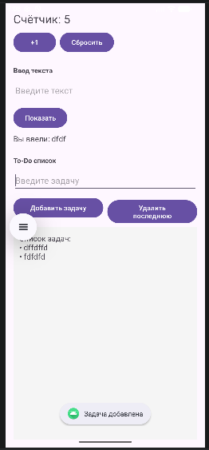
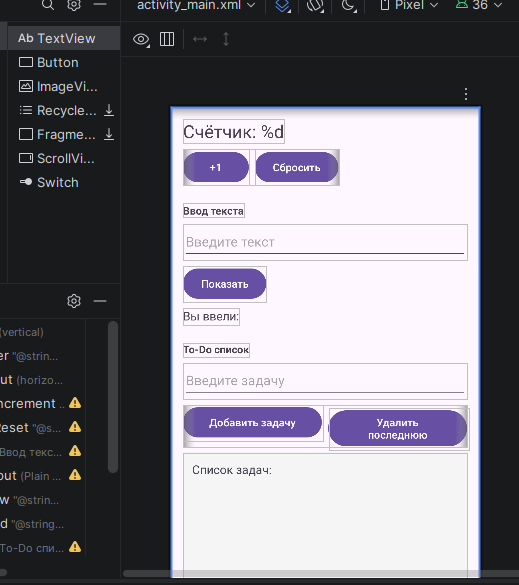

# Лабораторная работа №5

<div align="center">

**МИНИСТЕРСТВО НАУКИ И ВЫСШЕГО ОБРАЗОВАНИЯ РОССИЙСКОЙ ФЕДЕРАЦИИ**  
**ФЕДЕРАЛЬНОЕ ГОСУДАРСТВЕННОЕ БЮДЖЕТНОЕ ОБРАЗОВАТЕЛЬНОЕ УЧРЕЖДЕНИЕ ВЫСШЕГО ОБРАЗОВАНИЯ**  
**«САХАЛИНСКИЙ ГОСУДАРСТВЕННЫЙ УНИВЕРСИТЕТ»**

<br>
<br>

Институт естественных наук и техносферной безопасности  
Кафедра информатики  
**Пахомов Владимир Романович**

<br>
<br>
<br>
<br>

Лабораторная работа №5  
**Счетчик нажатий, поле ввода и отображение текста. Реализация ToDo-списка**  
01.03.02 Прикладная математика и информатика  
3 Курс

<br>
<br>
<br>
<br>
<br>
<br>
<br>
<br>
<br>
<br>
<br>
<br>
<br>

<div align="right">
Научный руководитель<br>
Соболев Евгений Игоревич
</div>

<br>
<br>
<br>

г. Южно-Сахалинск  
2026 г.

</div>

## Цель работы

Научиться обрабатывать пользовательский ввод, работать с состоянием (счетчик, список задач), динамически обновлять интерфейс приложения на Kotlin.

## Индивидуальное задание: Удаление последней задачи

В дополнение к базовому функционалу (счётчик, отображение введённого текста, добавление задач) была реализована кнопка **«Удалить последнюю»**, которая позволяет удалять последнюю добавленную задачу из списка. При удалении отображается всплывающее сообщение с текстом удалённой задачи, а интерфейс списка обновляется автоматически. Также реализовано сохранение состояния счётчика и списка задач при повороте экрана с помощью `onSaveInstanceState`.

## Скриншоты

  

<br>

  


## Листинги

### 1. activity_main.xml

```xml
<?xml version="1.0" encoding="utf-8"?>
<LinearLayout
    xmlns:android="http://schemas.android.com/apk/res/android"
    android:layout_width="match_parent"
    android:layout_height="match_parent"
    android:orientation="vertical"
    android:padding="16dp">

    <!-- БЛОК 1: СЧЁТЧИК -->
    <TextView
        android:id="@+id/textCounter"
        android:layout_width="wrap_content"
        android:layout_height="wrap_content"
        android:text="@string/counter_text"
        android:textSize="24sp"
        android:layout_marginBottom="8dp"/>

    <LinearLayout
        android:layout_width="wrap_content"
        android:layout_height="wrap_content"
        android:orientation="horizontal"
        android:layout_marginBottom="24dp">

        <Button
            android:id="@+id/buttonIncrement"
            android:layout_width="wrap_content"
            android:layout_height="wrap_content"
            android:text="@string/button_increment"
            android:layout_marginEnd="8dp"/>

        <Button
            android:id="@+id/buttonReset"
            android:layout_width="wrap_content"
            android:layout_height="wrap_content"
            android:text="@string/button_reset"/>
    </LinearLayout>

    <!-- БЛОК 2: ПОЛЕ ВВОДА И ОТОБРАЖЕНИЕ ТЕКСТА -->
    <TextView
        android:layout_width="wrap_content"
        android:layout_height="wrap_content"
        android:text="=== Ввод текста ==="
        android:textStyle="bold"
        android:layout_marginBottom="8dp"/>

    <EditText
        android:id="@+id/editTextInput"
        android:layout_width="match_parent"
        android:layout_height="wrap_content"
        android:hint="@string/hint_input"
        android:inputType="text"
        android:layout_marginBottom="8dp"/>

    <Button
        android:id="@+id/buttonShow"
        android:layout_width="wrap_content"
        android:layout_height="wrap_content"
        android:text="@string/button_show"
        android:layout_marginBottom="8dp"/>

    <TextView
        android:id="@+id/textEntered"
        android:layout_width="wrap_content"
        android:layout_height="wrap_content"
        android:text="@string/label_entered"
        android:textSize="16sp"
        android:layout_marginBottom="24dp"/>

    <!-- БЛОК 3: TO-DO СПИСОК -->
    <TextView
        android:layout_width="wrap_content"
        android:layout_height="wrap_content"
        android:text="=== To-Do список ==="
        android:textStyle="bold"
        android:layout_marginBottom="8dp"/>

    <EditText
        android:id="@+id/editTextTask"
        android:layout_width="match_parent"
        android:layout_height="wrap_content"
        android:hint="Введите задачу"
        android:inputType="text"
        android:layout_marginBottom="8dp"/>

    <LinearLayout
        android:layout_width="match_parent"
        android:layout_height="wrap_content"
        android:orientation="horizontal"
        android:layout_marginBottom="8dp">

        <Button
            android:id="@+id/buttonAddTask"
            android:layout_width="0dp"
            android:layout_height="wrap_content"
            android:layout_weight="1"
            android:text="@string/button_add_task"
            android:layout_marginEnd="4dp"/>

        <Button
            android:id="@+id/buttonRemoveLast"
            android:layout_width="0dp"
            android:layout_height="wrap_content"
            android:layout_weight="1"
            android:text="@string/button_remove_last"
            android:layout_marginStart="4dp"/>
    </LinearLayout>

    <TextView
        android:id="@+id/textTasks"
        android:layout_width="match_parent"
        android:layout_height="0dp"
        android:layout_weight="1"
        android:text="@string/label_tasks"
        android:textSize="16sp"
        android:background="#F5F5F5"
        android:padding="12dp"
        android:scrollbars="vertical"/>

</LinearLayout>
```

### 2. strings.xml

```xml
<resources>
    <string name="app_name">TodoApp</string>
    <string name="counter_text">Счётчик: %d</string>
    <string name="button_increment">+1</string>
    <string name="button_reset">Сбросить</string>
    <string name="hint_input">Введите текст</string>
    <string name="button_show">Показать</string>
    <string name="button_add_task">Добавить задачу</string>
    <string name="button_remove_last">Удалить последнюю</string>
    <string name="label_entered">Вы ввели:</string>
    <string name="label_tasks">Список задач:</string>
    <string name="task_empty_message">Нет задач</string>
</resources>
```

### 3. MainActivity.kt

```kotlin
package com.example.todoapp

import android.os.Bundle
import android.widget.Button
import android.widget.EditText
import android.widget.TextView
import android.widget.Toast
import androidx.activity.enableEdgeToEdge
import androidx.appcompat.app.AppCompatActivity
import androidx.core.view.ViewCompat
import androidx.core.view.WindowInsetsCompat

class MainActivity : AppCompatActivity() {
    // Переменные для хранения данных
    private var counter = 0
    private val tasks = mutableListOf<String>()

    // Компоненты интерфейса
    private lateinit var textCounter: TextView
    private lateinit var buttonIncrement: Button
    private lateinit var buttonReset: Button
    private lateinit var editTextInput: EditText
    private lateinit var buttonShow: Button
    private lateinit var textEntered: TextView
    private lateinit var editTextTask: EditText
    private lateinit var buttonAddTask: Button
    private lateinit var buttonRemoveLast: Button
    private lateinit var textTasks: TextView

    override fun onCreate(savedInstanceState: Bundle?) {
        super.onCreate(savedInstanceState)
        setContentView(R.layout.activity_main)

        // Инициализация компонентов
        initViews()

        // Восстановление состояния при повороте экрана
        if (savedInstanceState != null) {
            counter = savedInstanceState.getInt("counter", 0)
            val savedTasks = savedInstanceState.getStringArrayList("tasks")
            if (savedTasks != null) {
                tasks.clear()
                tasks.addAll(savedTasks)
            }
            updateCounterDisplay()
            updateTasksDisplay()
        }

        // Установка обработчиков
        setupListeners()
    }

    private fun initViews() {
        textCounter = findViewById(R.id.textCounter)
        buttonIncrement = findViewById(R.id.buttonIncrement)
        buttonReset = findViewById(R.id.buttonReset)
        editTextInput = findViewById(R.id.editTextInput)
        buttonShow = findViewById(R.id.buttonShow)
        textEntered = findViewById(R.id.textEntered)
        editTextTask = findViewById(R.id.editTextTask)
        buttonAddTask = findViewById(R.id.buttonAddTask)
        buttonRemoveLast = findViewById(R.id.buttonRemoveLast)
        textTasks = findViewById(R.id.textTasks)
    }

    private fun setupListeners() {
        // Обработчик для кнопки +1
        buttonIncrement.setOnClickListener {
            counter++
            updateCounterDisplay()
            Toast.makeText(this, "Счётчик: $counter", Toast.LENGTH_SHORT).show()
        }

        // Обработчик для кнопки сброса счётчика
        buttonReset.setOnClickListener {
            counter = 0
            updateCounterDisplay()
            Toast.makeText(this, "Счётчик сброшен", Toast.LENGTH_SHORT).show()
        }

        // Обработчик для кнопки "Показать"
        buttonShow.setOnClickListener {
            val inputText = editTextInput.text.toString()
            if (inputText.isNotBlank()) {
                textEntered.text = "${getString(R.string.label_entered)} $inputText"
                editTextInput.text.clear()
            } else {
                Toast.makeText(this, "Введите текст", Toast.LENGTH_SHORT).show()
            }
        }

        // Обработчик для кнопки "Добавить задачу"
        buttonAddTask.setOnClickListener {
            val task = editTextTask.text.toString()
            if (task.isNotBlank()) {
                tasks.add(task)
                updateTasksDisplay()
                editTextTask.text.clear()
                Toast.makeText(this, "Задача добавлена", Toast.LENGTH_SHORT).show()
            } else {
                Toast.makeText(this, "Введите задачу", Toast.LENGTH_SHORT).show()
            }
        }

        // Обработчик для кнопки "Удалить последнюю"
        buttonRemoveLast.setOnClickListener {
            if (tasks.isNotEmpty()) {
                val removedTask = tasks.removeAt(tasks.size - 1)
                updateTasksDisplay()
                Toast.makeText(this, "Удалено: $removedTask", Toast.LENGTH_SHORT).show()
            } else {
                Toast.makeText(this, "Нет задач для удаления", Toast.LENGTH_SHORT).show()
            }
        }
    }

    // Обновление отображения счётчика
    private fun updateCounterDisplay() {
        textCounter.text = getString(R.string.counter_text, counter)
    }

    // Обновление отображения списка задач
    private fun updateTasksDisplay() {
        if (tasks.isEmpty()) {
            textTasks.text = getString(R.string.label_tasks) + "\n" + getString(R.string.task_empty_message)
        } else {
            val tasksText = tasks.joinToString("\n") { "• $it" }
            textTasks.text = getString(R.string.label_tasks) + "\n" + tasksText
        }
    }

    // Сохранение состояния при повороте экрана
    override fun onSaveInstanceState(outState: Bundle) {
        super.onSaveInstanceState(outState)
        outState.putInt("counter", counter)
        outState.putStringArrayList("tasks", ArrayList(tasks))
    }
}
```

## Ответы на контрольные вопросы

**1. Как получить текст из EditText?**

Для получения текста из поля ввода используется метод `text.toString()`:

```kotlin
val inputText = editText.text.toString()
```

Метод `text` возвращает объект `Editable`, который преобразуется в строку с помощью `toString()`. Полученный текст можно проверить на пустоту с помощью `isNotBlank()` или `isEmpty()`.

**2. Почему при повороте экрана данные (счётчик, список задач) сбрасываются? Как это можно исправить?**

При повороте экрана Android пересоздаёт активность: старый экземпляр `Activity` уничтожается, а новый создаётся заново, вызывая `onCreate()`. Все переменные, объявленные в классе, при этом теряют свои значения.

Для исправления этой проблемы используется метод `onSaveInstanceState()`, который сохраняет данные в `Bundle` перед уничтожением активности:

```kotlin
override fun onSaveInstanceState(outState: Bundle) {
    super.onSaveInstanceState(outState)
    outState.putInt("counter", counter)
    outState.putStringArrayList("tasks", ArrayList(tasks))
}
```

В `onCreate()` или `onRestoreInstanceState()` эти данные восстанавливаются.

**3. Для чего используется joinToString? Как изменить разделитель?**

`joinToString()` — это функция-расширение для коллекций, которая преобразует все элементы коллекции в одну строку с заданным разделителем.

По умолчанию разделитель — `", "` (запятая с пробелом). Изменить разделитель можно с помощью параметра `separator`:

```kotlin
// С новой строки
tasks.joinToString("\n") { "• $it" }

// С точкой с запятой
tasks.joinToString("; ")

// С пользовательским префиксом и суффиксом
tasks.joinToString(separator = ", ", prefix = "[", suffix = "]")
```

**4. В чём разница между List и MutableList?**

`List` и `MutableList` — это интерфейсы для работы с коллекциями в Kotlin.

**`List`** — это неизменяемый список. После создания такого списка нельзя добавить, удалить или изменить его элементы. Он предназначен только для чтения. Например, если в приложении хранится список дней недели, который не меняется, то лучше использовать `List`.

**`MutableList`** — это изменяемый список. Он поддерживает операции добавления (`add()`), удаления (`remove()`, `removeAt()`) и изменения элементов (`set()`). Такой список удобно использовать, когда данные могут меняться во время работы программы.

В данной лабораторной работе для хранения списка задач используется `MutableList<String>`, так как задачи динамически добавляются пользователем и удаляются кнопкой «Удалить последнюю». Если бы использовался обычный `List`, то добавить или удалить задачу было бы невозможно.


**5. Как очистить поле ввода после добавления задачи?**

Для очистки поля ввода используется метод `text.clear()` или `setText("")`:

```kotlin
editTextTask.text.clear()
```

В коде лабораторной работы это реализовано в обработчике кнопки добавления задачи:

```kotlin
buttonAddTask.setOnClickListener {
    val task = editTextTask.text.toString()
    if (task.isNotBlank()) {
        tasks.add(task)
        updateTasksDisplay()
        editTextTask.text.clear()  // Очистка поля
    }
}
```

## Вывод

В ходе выполнения лабораторной работы было разработано Android-приложение `TodoApp`, реализующее счётчик нажатий, поле ввода с отображением текста и ToDo-список задач.

В процессе работы были изучены и применены на практике:
- **LinearLayout** — использован в качестве корневого элемента для вертикального расположения всех блоков интерфейса
- **TextView, EditText, Button** — базовые виджеты для отображения информации, ввода текста и обработки действий пользователя
- **MutableList** — применён для динамического хранения списка задач с возможностью добавления и удаления
- **Обработка событий** — реализованы слушатели для всех кнопок с использованием `setOnClickListener`
- **Toast** — использован для вывода всплывающих уведомлений о действиях пользователя
- **Сохранение состояния** — реализовано с помощью `onSaveInstanceState()` для сохранения счётчика и списка задач при повороте экрана