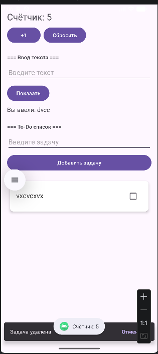
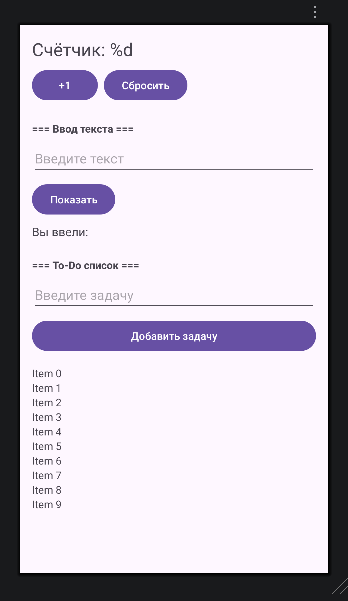

# Лабораторная работа №6

<div align="center">

**МИНИСТЕРСТВО НАУКИ И ВЫСШЕГО ОБРАЗОВАНИЯ РОССИЙСКОЙ ФЕДЕРАЦИИ**  
**ФЕДЕРАЛЬНОЕ ГОСУДАРСТВЕННОЕ БЮДЖЕТНОЕ ОБРАЗОВАТЕЛЬНОЕ УЧРЕЖДЕНИЕ ВЫСШЕГО ОБРАЗОВАНИЯ**  
**«САХАЛИНСКИЙ ГОСУДАРСТВЕННЫЙ УНИВЕРСИТЕТ»**

<br>
<br>

Институт естественных наук и техносферной безопасности  
Кафедра информатики  
**Пахомов Владимир Романович**

<br>
<br>
<br>
<br>

Лабораторная работа №6  
**Отображение списка задач из предыдущей лабораторной в красивых карточках**  
01.03.02 Прикладная математика и информатика  
3 Курс

<br>
<br>
<br>
<br>
<br>
<br>
<br>
<br>
<br>
<br>
<br>
<br>
<br>

<div align="right">
Научный руководитель<br>
Соболев Евгений Игоревич
</div>

<br>
<br>
<br>

г. Южно-Сахалинск  
2026 г.

</div>

## Цель работы

Научиться использовать `RecyclerView` для отображения списка данных, освоить создание адаптера и ViewHolder, применить `CardView` для оформления элементов списка.

## Индивидуальное задание: Удаление свайпом

Реализовано удаление задачи свайпом влево с помощью `ItemTouchHelper.SimpleCallback`. При свайпе задача удаляется из списка, адаптер обновляется, а пользователю показывается `Snackbar` с возможностью отмены удаления. При нажатии на «Отменить» задача возвращается обратно в список.

## Скриншоты

  

<br>

  


## Листинги

### 1. activity_main.xml

<?xml version="1.0" encoding="utf-8"?>
<LinearLayout
    xmlns:android="http://schemas.android.com/apk/res/android"
    android:layout_width="match_parent"
    android:layout_height="match_parent"
    android:orientation="vertical"
    android:padding="16dp">

    <TextView
        android:id="@+id/textCounter"
        android:layout_width="wrap_content"
        android:layout_height="wrap_content"
        android:text="@string/counter_text"
        android:textSize="24sp"
        android:layout_marginBottom="8dp"/>

    <LinearLayout
        android:layout_width="wrap_content"
        android:layout_height="wrap_content"
        android:orientation="horizontal"
        android:layout_marginBottom="24dp">

        <Button
            android:id="@+id/buttonIncrement"
            android:layout_width="wrap_content"
            android:layout_height="wrap_content"
            android:text="@string/button_increment"
            android:layout_marginEnd="8dp"/>

        <Button
            android:id="@+id/buttonReset"
            android:layout_width="wrap_content"
            android:layout_height="wrap_content"
            android:text="@string/button_reset"/>
    </LinearLayout>

    <TextView
        android:layout_width="wrap_content"
        android:layout_height="wrap_content"
        android:text="=== Ввод текста ==="
        android:textStyle="bold"
        android:layout_marginBottom="8dp"/>

    <EditText
        android:id="@+id/editTextInput"
        android:layout_width="match_parent"
        android:layout_height="wrap_content"
        android:inputType="text"
        android:hint="@string/hint_input"
        android:layout_marginBottom="8dp"/>

    <Button
        android:id="@+id/buttonShow"
        android:layout_width="wrap_content"
        android:layout_height="wrap_content"
        android:text="@string/button_show"
        android:layout_marginBottom="8dp"/>

    <TextView
        android:id="@+id/textEntered"
        android:layout_width="wrap_content"
        android:layout_height="wrap_content"
        android:text="@string/label_entered"
        android:textSize="16sp"
        android:layout_marginBottom="24dp"/>

    <TextView
        android:layout_width="wrap_content"
        android:layout_height="wrap_content"
        android:text="=== To-Do список ==="
        android:textStyle="bold"
        android:layout_marginBottom="8dp"/>

    <EditText
        android:id="@+id/editTextTask"
        android:layout_width="match_parent"
        android:layout_height="wrap_content"
        android:hint="Введите задачу"
        android:inputType="text"
        android:layout_marginBottom="8dp"/>

    <Button
        android:id="@+id/buttonAddTask"
        android:layout_width="match_parent"
        android:layout_height="wrap_content"
        android:text="@string/button_add_task"
        android:layout_marginBottom="16dp"/>

    <androidx.recyclerview.widget.RecyclerView
        android:id="@+id/recyclerViewTasks"
        android:layout_width="match_parent"
        android:layout_height="match_parent"/>

</LinearLayout>
```

### 2. item_task.xml

<?xml version="1.0" encoding="utf-8"?>
<androidx.cardview.widget.CardView
    xmlns:android="http://schemas.android.com/apk/res/android"
    xmlns:app="http://schemas.android.com/apk/res-auto"
    android:layout_width="match_parent"
    android:layout_height="wrap_content"
    android:layout_margin="8dp"
    app:cardCornerRadius="8dp"
    app:cardElevation="4dp"
    app:cardBackgroundColor="#FFFFFF">

    <LinearLayout
        android:layout_width="match_parent"
        android:layout_height="wrap_content"
        android:orientation="horizontal"
        android:padding="16dp">

        <TextView
            android:id="@+id/textTask"
            android:layout_width="0dp"
            android:layout_height="wrap_content"
            android:layout_weight="1"
            android:textSize="18sp"
            android:textColor="#333333"/>

        <CheckBox
            android:id="@+id/checkTask"
            android:layout_width="wrap_content"
            android:layout_height="wrap_content"/>

    </LinearLayout>

</androidx.cardview.widget.CardView>
```

### 3. MainActivity.kt

```kotlin
package com.example.todoapp

import android.os.Bundle
import android.widget.Button
import android.widget.EditText
import android.widget.TextView
import android.widget.Toast
import androidx.appcompat.app.AppCompatActivity
import androidx.recyclerview.widget.ItemTouchHelper
import androidx.recyclerview.widget.LinearLayoutManager
import androidx.recyclerview.widget.RecyclerView
import com.google.android.material.snackbar.Snackbar

class MainActivity : AppCompatActivity() {

    private var counter = 0
    private val tasks = mutableListOf<String>()
    private lateinit var adapter: TaskAdapter
    private lateinit var textCounter: TextView
    private lateinit var textEntered: TextView

    override fun onCreate(savedInstanceState: Bundle?) {
        super.onCreate(savedInstanceState)
        setContentView(R.layout.activity_main)

        textCounter = findViewById(R.id.textCounter)
        textEntered = findViewById(R.id.textEntered)
        val buttonIncrement = findViewById<Button>(R.id.buttonIncrement)
        val buttonReset = findViewById<Button>(R.id.buttonReset)
        val editTextInput = findViewById<EditText>(R.id.editTextInput)
        val buttonShow = findViewById<Button>(R.id.buttonShow)
        val editTextTask = findViewById<EditText>(R.id.editTextTask)
        val buttonAddTask = findViewById<Button>(R.id.buttonAddTask)
        val recyclerView = findViewById<RecyclerView>(R.id.recyclerViewTasks)

        // Настройка RecyclerView
        recyclerView.layoutManager = LinearLayoutManager(this)
        adapter = TaskAdapter(
            tasks,
            onItemCheckedChange = { _, _ -> },
            onItemLongClick = { position -> removeTaskWithUndo(position) }
        )
        recyclerView.adapter = adapter

        // СВАЙП ДЛЯ УДАЛЕНИЯ (индивидуальное задание)
        val swipeToDeleteCallback = object : ItemTouchHelper.SimpleCallback(
            0, ItemTouchHelper.LEFT or ItemTouchHelper.RIGHT
        ) {
            override fun onMove(
                recyclerView: RecyclerView,
                viewHolder: RecyclerView.ViewHolder,
                target: RecyclerView.ViewHolder
            ): Boolean = false

            override fun onSwiped(viewHolder: RecyclerView.ViewHolder, direction: Int) {
                val position = viewHolder.adapterPosition
                removeTaskWithUndo(position)
            }
        }

        ItemTouchHelper(swipeToDeleteCallback).attachToRecyclerView(recyclerView)

        // Восстановление состояния при повороте
        if (savedInstanceState != null) {
            counter = savedInstanceState.getInt("counter", 0)
            val savedTasks = savedInstanceState.getStringArrayList("tasks")
            val savedStates = savedInstanceState.getBooleanArray("checkedStates")
            if (savedTasks != null) {
                tasks.clear()
                tasks.addAll(savedTasks)
                adapter.updateData(tasks, savedStates?.toList())
            }
            updateCounterDisplay()
        }

        // Счётчик
        buttonIncrement.setOnClickListener {
            counter++
            updateCounterDisplay()
            Toast.makeText(this, "Счётчик: $counter", Toast.LENGTH_SHORT).show()
        }

        buttonReset.setOnClickListener {
            counter = 0
            updateCounterDisplay()
            Toast.makeText(this, "Счётчик сброшен", Toast.LENGTH_SHORT).show()
        }

        // Показать текст
        buttonShow.setOnClickListener {
            val inputText = editTextInput.text.toString()
            if (inputText.isNotBlank()) {
                textEntered.text = "${getString(R.string.label_entered)} $inputText"
                editTextInput.text.clear()
            } else {
                Toast.makeText(this, "Введите текст", Toast.LENGTH_SHORT).show()
            }
        }

        // Добавить задачу
        buttonAddTask.setOnClickListener {
            val task = editTextTask.text.toString()
            if (task.isNotBlank()) {
                adapter.addTask(task)
                editTextTask.text.clear()
                Toast.makeText(this, "Задача добавлена", Toast.LENGTH_SHORT).show()
            } else {
                Toast.makeText(this, "Введите задачу", Toast.LENGTH_SHORT).show()
            }
        }
    }

    private fun updateCounterDisplay() {
        textCounter.text = getString(R.string.counter_text, counter)
    }

    private fun removeTaskWithUndo(position: Int) {
        val removedTask = adapter.removeTask(position)
        Snackbar.make(findViewById(android.R.id.content), "Задача удалена", Snackbar.LENGTH_LONG)
            .setAction("Отменить") {
                adapter.restoreTask(removedTask, position)
            }
            .show()
    }

    override fun onSaveInstanceState(outState: Bundle) {
        super.onSaveInstanceState(outState)
        outState.putInt("counter", counter)
        outState.putStringArrayList("tasks", ArrayList(tasks))
        val checkedStates = (0 until tasks.size).map { adapter.isChecked(it) }.toBooleanArray()
        outState.putBooleanArray("checkedStates", checkedStates)
    }
}
```

### 4. TaskAdapter.kt
```
package com.example.todoapp

import android.graphics.Paint
import android.view.LayoutInflater
import android.view.View
import android.view.ViewGroup
import android.widget.CheckBox
import android.widget.TextView
import androidx.recyclerview.widget.RecyclerView

class TaskAdapter(
    private val tasks: MutableList<String>,
    private val onItemCheckedChange: (Int, Boolean) -> Unit,
    private val onItemLongClick: (Int) -> Unit
) : RecyclerView.Adapter<TaskAdapter.TaskViewHolder>() {

    private val checkedStates = mutableListOf<Boolean>()

    init {
        repeat(tasks.size) { checkedStates.add(false) }
    }

    class TaskViewHolder(itemView: View) : RecyclerView.ViewHolder(itemView) {
        val textTask: TextView = itemView.findViewById(R.id.textTask)
        val checkTask: CheckBox = itemView.findViewById(R.id.checkTask)
    }

    override fun onCreateViewHolder(parent: ViewGroup, viewType: Int): TaskViewHolder {
        val view = LayoutInflater.from(parent.context)
            .inflate(R.layout.item_task, parent, false)
        return TaskViewHolder(view)
    }

    override fun onBindViewHolder(holder: TaskViewHolder, position: Int) {
        val task = tasks[position]
        holder.textTask.text = task

        holder.checkTask.setOnCheckedChangeListener(null)
        holder.checkTask.isChecked = checkedStates.getOrElse(position) { false }

        if (checkedStates.getOrElse(position) { false }) {
            holder.textTask.paintFlags = holder.textTask.paintFlags or Paint.STRIKE_THRU_TEXT_FLAG
        } else {
            holder.textTask.paintFlags = holder.textTask.paintFlags and Paint.STRIKE_THRU_TEXT_FLAG.inv()
        }

        holder.checkTask.setOnCheckedChangeListener { _, isChecked ->
            checkedStates[position] = isChecked
            onItemCheckedChange(position, isChecked)
            if (isChecked) {
                holder.textTask.paintFlags = holder.textTask.paintFlags or Paint.STRIKE_THRU_TEXT_FLAG
            } else {
                holder.textTask.paintFlags = holder.textTask.paintFlags and Paint.STRIKE_THRU_TEXT_FLAG.inv()
            }
        }

        holder.itemView.setOnLongClickListener {
            onItemLongClick(position)
            true
        }
    }

    override fun getItemCount(): Int = tasks.size

    fun addTask(task: String) {
        tasks.add(task)
        checkedStates.add(false)
        notifyItemInserted(tasks.size - 1)
    }

    fun removeTask(position: Int): String {
        val removedTask = tasks.removeAt(position)
        checkedStates.removeAt(position)
        notifyItemRemoved(position)
        return removedTask
    }

    fun restoreTask(task: String, position: Int) {
        tasks.add(position, task)
        checkedStates.add(position, false)
        notifyItemInserted(position)
    }

    fun isChecked(position: Int): Boolean = checkedStates.getOrElse(position) { false }

    fun updateData(newTasks: List<String>, newStates: List<Boolean>? = null) {
        tasks.clear()
        checkedStates.clear()
        tasks.addAll(newTasks)
        if (newStates != null && newStates.size == newTasks.size) {
            checkedStates.addAll(newStates)
        } else {
            repeat(newTasks.size) { checkedStates.add(false) }
        }
        notifyDataSetChanged()
    }
}
```


## Ответы на контрольные вопросы

**1. Для чего нужен RecyclerView? Чем он лучше ListView?**

`RecyclerView` нужен для эффективного отображения больших списков данных. Он лучше `ListView` тем, что переиспользует ViewHolder (меньше вызовов `findViewById`), поддерживает разные LayoutManager (горизонтальный, сетка, staggered), имеет встроенные анимации добавления/удаления элементов и разделяет ответственность между LayoutManager, Adapter и ItemAnimator.

**2. Какие компоненты необходимы для работы RecyclerView?**

- **LayoutManager** — определяет расположение элементов (LinearLayoutManager, GridLayoutManager)
- **Adapter** — связывает данные с элементами списка
- **ViewHolder** — кэширует ссылки на View внутри элемента

**3. Что такое ViewHolder и для чего он используется?**

`ViewHolder` — это внутренний класс адаптера, который хранит ссылки на View внутри одного элемента списка (TextView, CheckBox и т.д.). Он используется для оптимизации производительности: вместо вызова `findViewById()` при каждом скролле, ссылки сохраняются один раз в `onCreateViewHolder()` и переиспользуются в `onBindViewHolder()`.

**4. Чем отличается notifyDataSetChanged() от notifyItemInserted()?**

`notifyDataSetChanged()` обновляет весь список целиком — перерисовываются все элементы, анимации нет. `notifyItemInserted()` уведомляет о добавлении элемента в конкретную позицию — перерисовывается только эта позиция, воспроизводится анимация добавления.

**5. Как добавить обработку кликов на элементы RecyclerView?**

Через интерфейс в адаптере: создать лямбда-параметр в конструкторе адаптера, в `onBindViewHolder()` установить слушатель на `holder.itemView.setOnClickListener { ... }`, а в `MainActivity` передать реализацию этого интерфейса.

## Вывод

В ходе выполнения лабораторной работы №6 было модернизировано приложение `TodoApp` из лабораторной работы №5: старый `TextView` для отображения списка задач заменён на современный `RecyclerView` с оформлением элементов в виде карточек.

В процессе работы были изучены и применены на практике:
- **RecyclerView** — для эффективного отображения списка с переиспользованием элементов
- **LayoutManager** — использован `LinearLayoutManager` для вертикального расположения карточек
- **Adapter и ViewHolder** — создан класс `TaskAdapter` с внутренним `TaskViewHolder` для оптимальной производительности
- **CardView** — каждый элемент списка оформлен в виде материальной карточки с закруглёнными углами и тенью
- **ItemTouchHelper** — реализовано удаление задачи свайпом влево/вправо
- **Snackbar** — при удалении показывается сообщение с кнопкой «Отменить» для восстановления задачи

Индивидуальное задание «Удаление свайпом» выполнено полностью.

Приложение успешно запускается и работает на эмуляторе. Все функции предыдущей лабораторной работы сохранены, а список задач получил современный и приятный внешний вид с анимациями добавления и удаления. Цель работы достигнута.