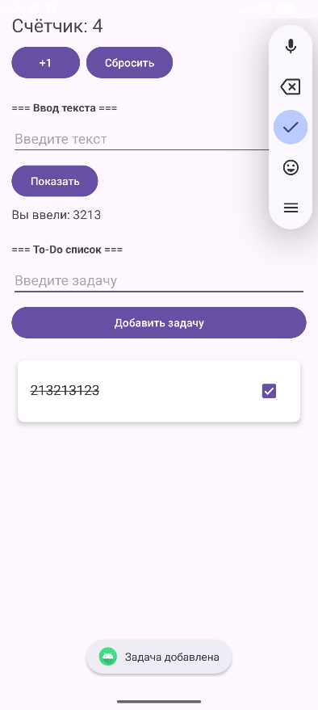
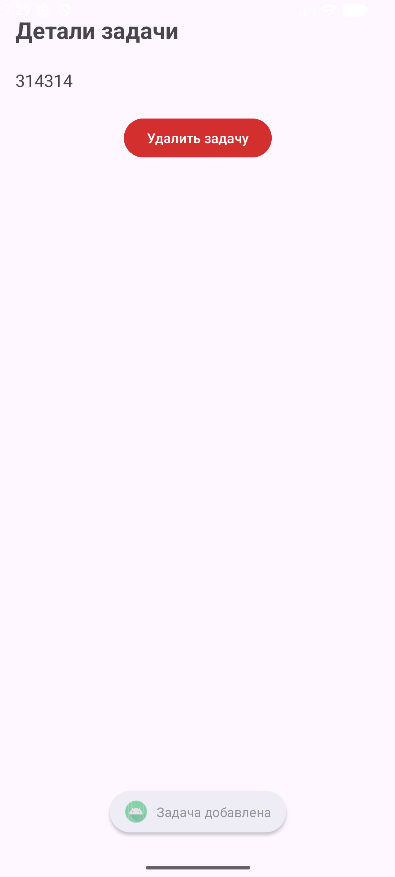
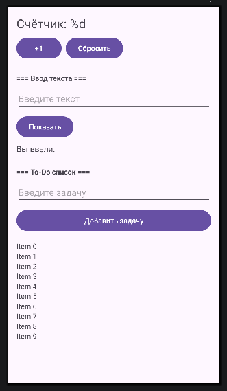

# Лабораторная работа №7

<div align="center">

**МИНИСТЕРСТВО НАУКИ И ВЫСШЕГО ОБРАЗОВАНИЯ РОССИЙСКОЙ ФЕДЕРАЦИИ**  
**ФЕДЕРАЛЬНОЕ ГОСУДАРСТВЕННОЕ БЮДЖЕТНОЕ ОБРАЗОВАТЕЛЬНОЕ УЧРЕЖДЕНИЕ ВЫСШЕГО ОБРАЗОВАНИЯ**  
**«САХАЛИНСКИЙ ГОСУДАРСТВЕННЫЙ УНИВЕРСИТЕТ»**

<br>
<br>

Институт естественных наук и техносферной безопасности  
Кафедра информатики  
**Пахомов Владимир Романович**

<br>
<br>
<br>
<br>

Лабораторная работа №7  
**Добавление второго экрана (детали задачи). Переход по клику на элемент списка**  
01.03.02 Прикладная математика и информатика  
3 Курс

<br>
<br>
<br>
<br>
<br>
<br>
<br>
<br>
<br>
<br>
<br>
<br>
<br>

<div align="right">
Научный руководитель<br>
Соболев Евгений Игоревич
</div>

<br>
<br>
<br>

г. Южно-Сахалинск  
2026 г.

</div>

## Цель работы

Научиться создавать многоэкранные приложения, осуществлять переход между экранами с передачей данных через Intent, обрабатывать клики на элементах RecyclerView.

## Индивидуальное задание: Удаление задачи с экрана деталей

При нажатии на карточку задачи открывается второй экран (DetailActivity) с текстом задачи и кнопкой «Удалить задачу». При нажатии на кнопку задача удаляется из списка, второй экран закрывается, список на главном экране автоматически обновляется. Для передачи позиции удаляемой задачи используется Intent, а для получения результата — `registerForActivityResult` (современный API вместо устаревшего `onActivityResult`).

## Скриншоты

  

<br>

  

<br>

  

## Листинги

### 1. activity_main.xml

```xml
<?xml version="1.0" encoding="utf-8"?>
<LinearLayout
    xmlns:android="http://schemas.android.com/apk/res/android"
    android:layout_width="match_parent"
    android:layout_height="match_parent"
    android:orientation="vertical"
    android:padding="16dp">

    <TextView
        android:id="@+id/textCounter"
        android:layout_width="wrap_content"
        android:layout_height="wrap_content"
        android:text="@string/counter_text"
        android:textSize="24sp"
        android:layout_marginBottom="8dp"/>

    <LinearLayout
        android:layout_width="wrap_content"
        android:layout_height="wrap_content"
        android:orientation="horizontal"
        android:layout_marginBottom="24dp">

        <Button
            android:id="@+id/buttonIncrement"
            android:layout_width="wrap_content"
            android:layout_height="wrap_content"
            android:text="@string/button_increment"
            android:layout_marginEnd="8dp"/>

        <Button
            android:id="@+id/buttonReset"
            android:layout_width="wrap_content"
            android:layout_height="wrap_content"
            android:text="@string/button_reset"/>
    </LinearLayout>

    <TextView
        android:layout_width="wrap_content"
        android:layout_height="wrap_content"
        android:text="=== Ввод текста ==="
        android:textStyle="bold"
        android:layout_marginBottom="8dp"/>

    <EditText
        android:id="@+id/editTextInput"
        android:layout_width="match_parent"
        android:layout_height="wrap_content"
        android:inputType="text"
        android:hint="@string/hint_input"
        android:layout_marginBottom="8dp"/>

    <Button
        android:id="@+id/buttonShow"
        android:layout_width="wrap_content"
        android:layout_height="wrap_content"
        android:text="@string/button_show"
        android:layout_marginBottom="8dp"/>

    <TextView
        android:id="@+id/textEntered"
        android:layout_width="wrap_content"
        android:layout_height="wrap_content"
        android:text="@string/label_entered"
        android:textSize="16sp"
        android:layout_marginBottom="24dp"/>

    <TextView
        android:layout_width="wrap_content"
        android:layout_height="wrap_content"
        android:text="=== To-Do список ==="
        android:textStyle="bold"
        android:layout_marginBottom="8dp"/>

    <EditText
        android:id="@+id/editTextTask"
        android:layout_width="match_parent"
        android:layout_height="wrap_content"
        android:hint="Введите задачу"
        android:inputType="text"
        android:layout_marginBottom="8dp"/>

    <Button
        android:id="@+id/buttonAddTask"
        android:layout_width="match_parent"
        android:layout_height="wrap_content"
        android:text="@string/button_add_task"
        android:layout_marginBottom="16dp"/>

    <androidx.recyclerview.widget.RecyclerView
        android:id="@+id/recyclerViewTasks"
        android:layout_width="match_parent"
        android:layout_height="match_parent"/>

</LinearLayout>
```

### 2. activity_detail.xml

```xml
<?xml version="1.0" encoding="utf-8"?>
<LinearLayout
    xmlns:android="http://schemas.android.com/apk/res/android"
    android:layout_width="match_parent"
    android:layout_height="match_parent"
    android:orientation="vertical"
    android:padding="16dp">

    <TextView
        android:layout_width="wrap_content"
        android:layout_height="wrap_content"
        android:text="Детали задачи"
        android:textSize="24sp"
        android:textStyle="bold"
        android:layout_marginBottom="24sp"/>

    <TextView
        android:id="@+id/textTaskDetail"
        android:layout_width="match_parent"
        android:layout_height="wrap_content"
        android:textSize="18sp"
        android:layout_marginBottom="24sp"/>

    <Button
        android:id="@+id/buttonDelete"
        android:layout_width="wrap_content"
        android:layout_height="wrap_content"
        android:text="Удалить задачу"
        android:backgroundTint="#D32F2F"
        android:layout_gravity="center_horizontal"/>

</LinearLayout>
```

### 3. item_task.xml

```xml
<?xml version="1.0" encoding="utf-8"?>
<androidx.cardview.widget.CardView
    xmlns:android="http://schemas.android.com/apk/res/android"
    xmlns:app="http://schemas.android.com/apk/res-auto"
    android:layout_width="match_parent"
    android:layout_height="wrap_content"
    android:layout_margin="8dp"
    app:cardCornerRadius="8dp"
    app:cardElevation="4dp"
    app:cardBackgroundColor="#FFFFFF">

    <LinearLayout
        android:layout_width="match_parent"
        android:layout_height="wrap_content"
        android:orientation="horizontal"
        android:padding="16dp">

        <TextView
            android:id="@+id/textTask"
            android:layout_width="0dp"
            android:layout_height="wrap_content"
            android:layout_weight="1"
            android:textSize="18sp"
            android:textColor="#333333"/>

        <CheckBox
            android:id="@+id/checkTask"
            android:layout_width="wrap_content"
            android:layout_height="wrap_content"/>

    </LinearLayout>

</androidx.cardview.widget.CardView>
```

### 4. MainActivity.kt

```kotlin
package com.example.todoapp

import android.app.Activity
import android.content.Intent
import android.os.Bundle
import android.widget.Button
import android.widget.EditText
import android.widget.TextView
import android.widget.Toast
import androidx.activity.result.contract.ActivityResultContracts
import androidx.appcompat.app.AppCompatActivity
import androidx.recyclerview.widget.LinearLayoutManager
import androidx.recyclerview.widget.RecyclerView

class MainActivity : AppCompatActivity() {

    private var counter = 0
    private val tasks = mutableListOf<String>()
    private lateinit var adapter: TaskAdapter
    private lateinit var textCounter: TextView
    private lateinit var textEntered: TextView

    private val deleteTaskLauncher = registerForActivityResult(
        ActivityResultContracts.StartActivityForResult()
    ) { result ->
        if (result.resultCode == Activity.RESULT_OK) {
            val deletePosition = result.data?.getIntExtra("delete_position", -1) ?: -1
            if (deletePosition != -1 && deletePosition < tasks.size) {
                adapter.removeTask(deletePosition)
                Toast.makeText(this, "Задача удалена", Toast.LENGTH_SHORT).show()
            }
        }
    }

    override fun onCreate(savedInstanceState: Bundle?) {
        super.onCreate(savedInstanceState)
        setContentView(R.layout.activity_main)

        textCounter = findViewById(R.id.textCounter)
        textEntered = findViewById(R.id.textEntered)
        val buttonIncrement = findViewById<Button>(R.id.buttonIncrement)
        val buttonReset = findViewById<Button>(R.id.buttonReset)
        val editTextInput = findViewById<EditText>(R.id.editTextInput)
        val buttonShow = findViewById<Button>(R.id.buttonShow)
        val editTextTask = findViewById<EditText>(R.id.editTextTask)
        val buttonAddTask = findViewById<Button>(R.id.buttonAddTask)
        val recyclerView = findViewById<RecyclerView>(R.id.recyclerViewTasks)

        recyclerView.layoutManager = LinearLayoutManager(this)
        adapter = TaskAdapter(tasks) { position ->
            val intent = Intent(this, DetailActivity::class.java)
            intent.putExtra("task_text", tasks[position])
            intent.putExtra("task_position", position)
            deleteTaskLauncher.launch(intent)
        }
        recyclerView.adapter = adapter

        if (savedInstanceState != null) {
            counter = savedInstanceState.getInt("counter", 0)
            val savedTasks = savedInstanceState.getStringArrayList("tasks")
            if (savedTasks != null) {
                tasks.clear()
                tasks.addAll(savedTasks)
                adapter.notifyDataSetChanged()
            }
            updateCounterDisplay()
        }

        buttonIncrement.setOnClickListener {
            counter++
            updateCounterDisplay()
            Toast.makeText(this, "Счётчик: $counter", Toast.LENGTH_SHORT).show()
        }

        buttonReset.setOnClickListener {
            counter = 0
            updateCounterDisplay()
            Toast.makeText(this, "Счётчик сброшен", Toast.LENGTH_SHORT).show()
        }

        buttonShow.setOnClickListener {
            val inputText = editTextInput.text.toString()
            if (inputText.isNotBlank()) {
                textEntered.text = "${getString(R.string.label_entered)} $inputText"
                editTextInput.text.clear()
            } else {
                Toast.makeText(this, "Введите текст", Toast.LENGTH_SHORT).show()
            }
        }

        buttonAddTask.setOnClickListener {
            val task = editTextTask.text.toString()
            if (task.isNotBlank()) {
                adapter.addTask(task)
                editTextTask.text.clear()
                Toast.makeText(this, "Задача добавлена", Toast.LENGTH_SHORT).show()
            } else {
                Toast.makeText(this, "Введите задачу", Toast.LENGTH_SHORT).show()
            }
        }
    }

    private fun updateCounterDisplay() {
        textCounter.text = getString(R.string.counter_text, counter)
    }

    override fun onSaveInstanceState(outState: Bundle) {
        super.onSaveInstanceState(outState)
        outState.putInt("counter", counter)
        outState.putStringArrayList("tasks", ArrayList(tasks))
    }
}
```

### 5. DetailActivity.kt

```kotlin
package com.example.todoapp

import android.app.Activity
import android.content.Intent
import android.os.Bundle
import android.widget.Button
import android.widget.TextView
import androidx.appcompat.app.AppCompatActivity

class DetailActivity : AppCompatActivity() {

    override fun onCreate(savedInstanceState: Bundle?) {
        super.onCreate(savedInstanceState)
        setContentView(R.layout.activity_detail)

        val textTaskDetail = findViewById<TextView>(R.id.textTaskDetail)
        val buttonDelete = findViewById<Button>(R.id.buttonDelete)

        val taskText = intent.getStringExtra("task_text") ?: "Нет данных"
        val taskPosition = intent.getIntExtra("task_position", -1)

        textTaskDetail.text = taskText

        buttonDelete.setOnClickListener {
            if (taskPosition != -1) {
                val resultIntent = Intent()
                resultIntent.putExtra("delete_position", taskPosition)
                setResult(Activity.RESULT_OK, resultIntent)
                finish()
            }
        }
    }
}
```

### 6. TaskAdapter.kt

```kotlin
package com.example.todoapp

import android.view.LayoutInflater
import android.view.View
import android.view.ViewGroup
import android.widget.TextView
import androidx.recyclerview.widget.RecyclerView

class TaskAdapter(
    private val tasks: MutableList<String>,
    private val onItemClick: (Int) -> Unit
) : RecyclerView.Adapter<TaskAdapter.TaskViewHolder>() {

    class TaskViewHolder(itemView: View) : RecyclerView.ViewHolder(itemView) {
        val textTask: TextView = itemView.findViewById(R.id.textTask)
    }

    override fun onCreateViewHolder(parent: ViewGroup, viewType: Int): TaskViewHolder {
        val view = LayoutInflater.from(parent.context)
            .inflate(R.layout.item_task, parent, false)
        return TaskViewHolder(view)
    }

    override fun onBindViewHolder(holder: TaskViewHolder, position: Int) {
        holder.textTask.text = tasks[position]
        holder.itemView.setOnClickListener {
            onItemClick(position)
        }
    }

    override fun getItemCount(): Int = tasks.size

    fun addTask(task: String) {
        tasks.add(task)
        notifyItemInserted(tasks.size - 1)
    }

    fun removeTask(position: Int) {
        tasks.removeAt(position)
        notifyItemRemoved(position)
    }
}
```

## Ответы на контрольные вопросы

**1. Что такое Intent? Какие виды Intent существуют?**

`Intent` — это объект для выполнения различных операций: запуска Activity, передачи данных, отправки широковещательных сообщений. Существует два вида Intent: явный (explicit) — указывает конкретный компонент (например, `Intent(this, DetailActivity::class.java)`) и неявный (implicit) — описывает действие, которое нужно выполнить, а система сама находит подходящий компонент (например, открыть ссылку в браузере).

**2. Как передать данные из одной Activity в другую?**

Данные передаются через Intent с помощью метода `putExtra()`:

```kotlin
val intent = Intent(this, DetailActivity::class.java)
intent.putExtra("task_text", taskText)
intent.putExtra("task_position", position)
startActivity(intent)
```

В целевой Activity данные получаются так:

```kotlin
val taskText = intent.getStringExtra("task_text") ?: "Нет данных"
val taskPosition = intent.getIntExtra("task_position", -1)
```

**3. Какие способы обработки кликов на элементах RecyclerView вы знаете?**

- Передача лямбды в адаптер из Activity (использован в работе)
- Создание интерфейса слушателя внутри адаптера
- Установка `OnClickListener` непосредственно в `onBindViewHolder`

Рекомендуемый способ — передача лямбды, так как он простой и позволяет легко обрабатывать клики в Activity.

**4. Как создать новую Activity в Android Studio?**

Правой кнопкой мыши на пакете → `New` → `Activity` → `Empty Views Activity`. Ввести имя Activity (например, `DetailActivity`), имя layout-файла (подставится автоматически), снять галочку `Launcher Activity`. После нажатия `Finish` будут созданы файл Activity и соответствующий XML-файл разметки.

**5. Для чего используется метод `finish()`?**

Метод `finish()` закрывает текущую Activity и возвращает пользователя к предыдущей Activity (той, которая была открыта до текущей). В лабораторной работе `finish()` используется в `DetailActivity` после нажатия кнопки «Удалить задачу», чтобы закрыть экран деталей и вернуться к списку задач.

## Вывод

В ходе выполнения лабораторной работы №7 приложение `TodoApp` было дополнено вторым экраном для отображения деталей задачи.