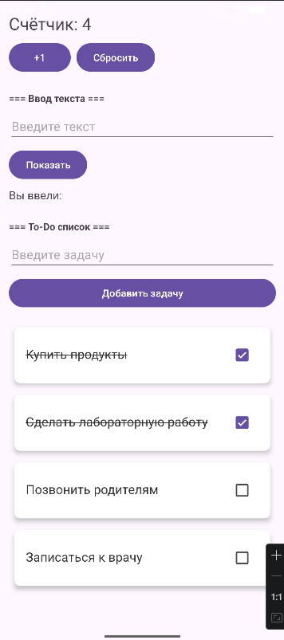
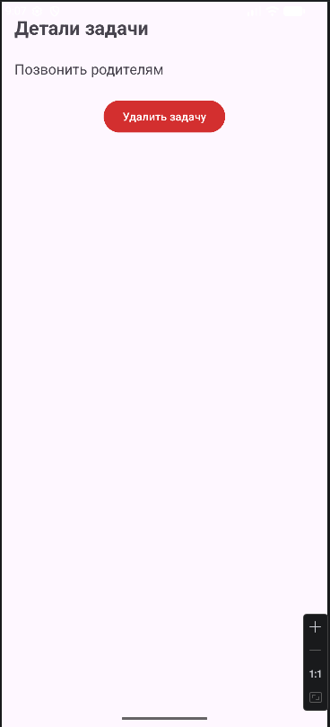
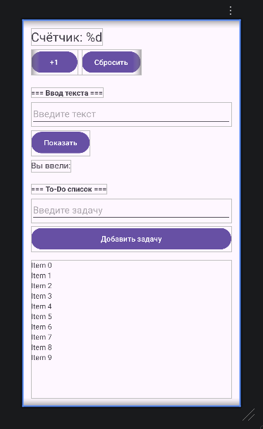

# Лабораторная работа №8

<div align="center">

**МИНИСТЕРСТВО НАУКИ И ВЫСШЕГО ОБРАЗОВАНИЯ РОССИЙСКОЙ ФЕДЕРАЦИИ**  
**ФЕДЕРАЛЬНОЕ ГОСУДАРСТВЕННОЕ БЮДЖЕТНОЕ ОБРАЗОВАТЕЛЬНОЕ УЧРЕЖДЕНИЕ ВЫСШЕГО ОБРАЗОВАНИЯ**  
**«САХАЛИНСКИЙ ГОСУДАРСТВЕННЫЙ УНИВЕРСИТЕТ»**

<br>
<br>

Институт естественных наук и техносферной безопасности  
Кафедра информатики  
**Пахомов Владимир Романович**

<br>
<br>
<br>
<br>

Лабораторная работа №8  
**Перенос логики списка задач из Activity в ViewModel. Использование StateFlow для хранения состояния**  
01.03.02 Прикладная математика и информатика  
3 Курс

<br>
<br>
<br>
<br>
<br>
<br>
<br>
<br>
<br>
<br>
<br>
<br>
<br>

<div align="right">
Научный руководитель<br>
Соболев Евгений Игоревич
</div>

<br>
<br>
<br>

г. Южно-Сахалинск  
2026 г.

</div>

## Цель работы

Изучить архитектурный компонент ViewModel, научиться выносить логику и состояние UI из Activity, использовать StateFlow для реактивного обновления данных, обеспечить сохранение состояния при изменении конфигурации.

## Индивидуальное задание: SharedFlow для уведомлений

Вместо прямого вызова `Toast.makeText()` в Activity, все всплывающие сообщения вынесены в ViewModel и отправляются через `SharedFlow`. Activity подписывается на этот поток и отображает уведомления. Это позволяет разграничить ответственность: ViewModel управляет логикой и событиями, Activity только отображает UI.

## Скриншоты

  

<br>

  

<br>

  

## Листинги

### 1. activity_main.xml

```xml
<?xml version="1.0" encoding="utf-8"?>
<LinearLayout
    xmlns:android="http://schemas.android.com/apk/res/android"
    android:layout_width="match_parent"
    android:layout_height="match_parent"
    android:orientation="vertical"
    android:padding="16dp">

    <TextView
        android:id="@+id/textCounter"
        android:layout_width="wrap_content"
        android:layout_height="wrap_content"
        android:text="@string/counter_text"
        android:textSize="24sp"
        android:layout_marginBottom="8dp"/>

    <LinearLayout
        android:layout_width="wrap_content"
        android:layout_height="wrap_content"
        android:orientation="horizontal"
        android:layout_marginBottom="24dp">

        <Button
            android:id="@+id/buttonIncrement"
            android:layout_width="wrap_content"
            android:layout_height="wrap_content"
            android:text="@string/button_increment"
            android:layout_marginEnd="8dp"/>

        <Button
            android:id="@+id/buttonReset"
            android:layout_width="wrap_content"
            android:layout_height="wrap_content"
            android:text="@string/button_reset"/>
    </LinearLayout>

    <TextView
        android:layout_width="wrap_content"
        android:layout_height="wrap_content"
        android:text="=== Ввод текста ==="
        android:textStyle="bold"
        android:layout_marginBottom="8dp"/>

    <EditText
        android:id="@+id/editTextInput"
        android:layout_width="match_parent"
        android:layout_height="wrap_content"
        android:inputType="text"
        android:hint="@string/hint_input"
        android:layout_marginBottom="8dp"/>

    <Button
        android:id="@+id/buttonShow"
        android:layout_width="wrap_content"
        android:layout_height="wrap_content"
        android:text="@string/button_show"
        android:layout_marginBottom="8dp"/>

    <TextView
        android:id="@+id/textEntered"
        android:layout_width="wrap_content"
        android:layout_height="wrap_content"
        android:text="@string/label_entered"
        android:textSize="16sp"
        android:layout_marginBottom="24dp"/>

    <TextView
        android:layout_width="wrap_content"
        android:layout_height="wrap_content"
        android:text="=== To-Do список ==="
        android:textStyle="bold"
        android:layout_marginBottom="8dp"/>

    <EditText
        android:id="@+id/editTextTask"
        android:layout_width="match_parent"
        android:layout_height="wrap_content"
        android:hint="Введите задачу"
        android:inputType="text"
        android:layout_marginBottom="8dp"/>

    <Button
        android:id="@+id/buttonAddTask"
        android:layout_width="match_parent"
        android:layout_height="wrap_content"
        android:text="@string/button_add_task"
        android:layout_marginBottom="16dp"/>

    <androidx.recyclerview.widget.RecyclerView
        android:id="@+id/recyclerViewTasks"
        android:layout_width="match_parent"
        android:layout_height="match_parent"/>

</LinearLayout>
```

### 2. activity_detail.xml

```xml
<?xml version="1.0" encoding="utf-8"?>
<LinearLayout
    xmlns:android="http://schemas.android.com/apk/res/android"
    android:layout_width="match_parent"
    android:layout_height="match_parent"
    android:orientation="vertical"
    android:padding="16dp">

    <TextView
        android:layout_width="wrap_content"
        android:layout_height="wrap_content"
        android:text="Детали задачи"
        android:textSize="24sp"
        android:textStyle="bold"
        android:layout_marginBottom="24sp"/>

    <TextView
        android:id="@+id/textTaskDetail"
        android:layout_width="match_parent"
        android:layout_height="wrap_content"
        android:textSize="18sp"
        android:layout_marginBottom="24sp"/>

    <Button
        android:id="@+id/buttonDelete"
        android:layout_width="wrap_content"
        android:layout_height="wrap_content"
        android:text="Удалить задачу"
        android:backgroundTint="#D32F2F"
        android:layout_gravity="center_horizontal"/>

</LinearLayout>
```

### 3. item_task.xml

```xml
<?xml version="1.0" encoding="utf-8"?>
<androidx.cardview.widget.CardView
    xmlns:android="http://schemas.android.com/apk/res/android"
    xmlns:app="http://schemas.android.com/apk/res-auto"
    android:layout_width="match_parent"
    android:layout_height="wrap_content"
    android:layout_margin="8dp"
    app:cardCornerRadius="8dp"
    app:cardElevation="4dp"
    app:cardBackgroundColor="#FFFFFF">

    <LinearLayout
        android:layout_width="match_parent"
        android:layout_height="wrap_content"
        android:orientation="horizontal"
        android:padding="16dp">

        <TextView
            android:id="@+id/textTask"
            android:layout_width="0dp"
            android:layout_height="wrap_content"
            android:layout_weight="1"
            android:textSize="18sp"
            android:textColor="#333333"/>

        <CheckBox
            android:id="@+id/checkTask"
            android:layout_width="wrap_content"
            android:layout_height="wrap_content"/>

    </LinearLayout>

</androidx.cardview.widget.CardView>
```

### 4. MainViewModel.kt

```kotlin
package com.example.todoapp

import androidx.lifecycle.ViewModel
import androidx.lifecycle.viewModelScope
import kotlinx.coroutines.flow.MutableSharedFlow
import kotlinx.coroutines.flow.MutableStateFlow
import kotlinx.coroutines.flow.StateFlow
import kotlinx.coroutines.flow.asSharedFlow
import kotlinx.coroutines.flow.asStateFlow
import kotlinx.coroutines.launch

class MainViewModel : ViewModel() {

    private val _tasks = MutableStateFlow<List<String>>(emptyList())
    val tasks: StateFlow<List<String>> = _tasks.asStateFlow()

    private val _toastMessage = MutableSharedFlow<String>()
    val toastMessage = _toastMessage.asSharedFlow()

    fun addTask(task: String) {
        if (task.isBlank()) {
            sendToast("Задача не может быть пустой")
            return
        }
        val currentList = _tasks.value.toMutableList()
        currentList.add(task)
        _tasks.value = currentList
        sendToast("Задача добавлена")
    }

    fun deleteTask(position: Int) {
        val currentList = _tasks.value.toMutableList()
        if (position in currentList.indices) {
            val removed = currentList.removeAt(position)
            _tasks.value = currentList
            sendToast("Удалено: $removed")
        } else {
            sendToast("Ошибка удаления")
        }
    }

    fun updateTask(position: Int, newText: String) {
        val currentList = _tasks.value.toMutableList()
        if (position in currentList.indices && newText.isNotBlank()) {
            currentList[position] = newText
            _tasks.value = currentList
            sendToast("Задача обновлена")
        }
    }

    fun loadTestData() {
        val testTasks = listOf(
            "Купить продукты",
            "Сделать лабораторную работу",
            "Позвонить родителям",
            "Записаться к врачу"
        )
        _tasks.value = testTasks
        sendToast("Тестовые данные загружены")
    }

    private fun sendToast(message: String) {
        viewModelScope.launch {
            _toastMessage.emit(message)
        }
    }
}
```

### 5. MainActivity.kt

```kotlin
package com.example.todoapp

import android.app.Activity
import android.content.Intent
import android.os.Bundle
import android.widget.Button
import android.widget.EditText
import android.widget.TextView
import android.widget.Toast
import androidx.activity.result.contract.ActivityResultContracts
import androidx.activity.viewModels
import androidx.appcompat.app.AppCompatActivity
import androidx.lifecycle.Lifecycle
import androidx.lifecycle.lifecycleScope
import androidx.lifecycle.repeatOnLifecycle
import androidx.recyclerview.widget.LinearLayoutManager
import androidx.recyclerview.widget.RecyclerView
import kotlinx.coroutines.launch

class MainActivity : AppCompatActivity() {

    private val viewModel: MainViewModel by viewModels()
    private lateinit var adapter: TaskAdapter
    private lateinit var textCounter: TextView
    private lateinit var textEntered: TextView
    private var counter = 0

    private val deleteTaskLauncher = registerForActivityResult(
        ActivityResultContracts.StartActivityForResult()
    ) { result ->
        if (result.resultCode == Activity.RESULT_OK) {
            val deletePosition = result.data?.getIntExtra("delete_position", -1) ?: -1
            if (deletePosition != -1) {
                viewModel.deleteTask(deletePosition)
            }
        }
    }

    override fun onCreate(savedInstanceState: Bundle?) {
        super.onCreate(savedInstanceState)
        setContentView(R.layout.activity_main)

        textCounter = findViewById(R.id.textCounter)
        textEntered = findViewById(R.id.textEntered)
        val buttonIncrement = findViewById<Button>(R.id.buttonIncrement)
        val buttonReset = findViewById<Button>(R.id.buttonReset)
        val editTextInput = findViewById<EditText>(R.id.editTextInput)
        val buttonShow = findViewById<Button>(R.id.buttonShow)
        val editTextTask = findViewById<EditText>(R.id.editTextTask)
        val buttonAddTask = findViewById<Button>(R.id.buttonAddTask)
        val recyclerView = findViewById<RecyclerView>(R.id.recyclerViewTasks)

        recyclerView.layoutManager = LinearLayoutManager(this)
        adapter = TaskAdapter(
            tasks = emptyList(),
            onItemClick = { position ->
                val taskText = viewModel.tasks.value[position]
                val intent = Intent(this, DetailActivity::class.java)
                intent.putExtra("task_text", taskText)
                intent.putExtra("task_position", position)
                deleteTaskLauncher.launch(intent)
            },
            onItemLongClick = { position ->
                viewModel.deleteTask(position)
            }
        )
        recyclerView.adapter = adapter

        lifecycleScope.launch {
            repeatOnLifecycle(Lifecycle.State.STARTED) {
                viewModel.tasks.collect { tasks ->
                    adapter.updateData(tasks)
                }
            }
        }

        lifecycleScope.launch {
            repeatOnLifecycle(Lifecycle.State.STARTED) {
                viewModel.toastMessage.collect { message ->
                    Toast.makeText(this@MainActivity, message, Toast.LENGTH_SHORT).show()
                }
            }
        }

        if (viewModel.tasks.value.isEmpty()) {
            viewModel.loadTestData()
        }

        buttonIncrement.setOnClickListener {
            counter++
            updateCounterDisplay()
        }

        buttonReset.setOnClickListener {
            counter = 0
            updateCounterDisplay()
        }

        buttonShow.setOnClickListener {
            val inputText = editTextInput.text.toString()
            if (inputText.isNotBlank()) {
                textEntered.text = "${getString(R.string.label_entered)} $inputText"
                editTextInput.text.clear()
            } else {
                Toast.makeText(this, "Введите текст", Toast.LENGTH_SHORT).show()
            }
        }

        buttonAddTask.setOnClickListener {
            val task = editTextTask.text.toString()
            if (task.isNotBlank()) {
                viewModel.addTask(task)
                editTextTask.text.clear()
            } else {
                Toast.makeText(this, "Введите задачу", Toast.LENGTH_SHORT).show()
            }
        }

        if (savedInstanceState != null) {
            counter = savedInstanceState.getInt("counter", 0)
            updateCounterDisplay()
        }
    }

    private fun updateCounterDisplay() {
        textCounter.text = getString(R.string.counter_text, counter)
    }

    override fun onSaveInstanceState(outState: Bundle) {
        super.onSaveInstanceState(outState)
        outState.putInt("counter", counter)
    }
}
```

### 6. DetailActivity.kt

```kotlin
package com.example.todoapp

import android.app.Activity
import android.content.Intent
import android.os.Bundle
import android.widget.Button
import android.widget.TextView
import androidx.appcompat.app.AppCompatActivity

class DetailActivity : AppCompatActivity() {

    override fun onCreate(savedInstanceState: Bundle?) {
        super.onCreate(savedInstanceState)
        setContentView(R.layout.activity_detail)

        val textTaskDetail = findViewById<TextView>(R.id.textTaskDetail)
        val buttonDelete = findViewById<Button>(R.id.buttonDelete)

        val taskText = intent.getStringExtra("task_text") ?: "Нет данных"
        val taskPosition = intent.getIntExtra("task_position", -1)

        textTaskDetail.text = taskText

        buttonDelete.setOnClickListener {
            if (taskPosition != -1) {
                val resultIntent = Intent()
                resultIntent.putExtra("delete_position", taskPosition)
                setResult(Activity.RESULT_OK, resultIntent)
                finish()
            }
        }
    }
}
```

### 7. TaskAdapter.kt

```kotlin
package com.example.todoapp

import android.graphics.Paint
import android.view.LayoutInflater
import android.view.View
import android.view.ViewGroup
import android.widget.CheckBox
import android.widget.TextView
import androidx.recyclerview.widget.RecyclerView

class TaskAdapter(
    private var tasks: List<String>,
    private val onItemClick: (Int) -> Unit,
    private val onItemLongClick: (Int) -> Unit
) : RecyclerView.Adapter<TaskAdapter.TaskViewHolder>() {

    private val checkedStates = mutableMapOf<Int, Boolean>()

    class TaskViewHolder(itemView: View) : RecyclerView.ViewHolder(itemView) {
        val textTask: TextView = itemView.findViewById(R.id.textTask)
        val checkTask: CheckBox = itemView.findViewById(R.id.checkTask)
    }

    override fun onCreateViewHolder(parent: ViewGroup, viewType: Int): TaskViewHolder {
        val view = LayoutInflater.from(parent.context)
            .inflate(R.layout.item_task, parent, false)
        return TaskViewHolder(view)
    }

    override fun onBindViewHolder(holder: TaskViewHolder, position: Int) {
        val task = tasks[position]
        holder.textTask.text = task

        holder.checkTask.setOnCheckedChangeListener(null)
        holder.checkTask.isChecked = checkedStates[position] ?: false

        if (checkedStates[position] == true) {
            holder.textTask.paintFlags = holder.textTask.paintFlags or Paint.STRIKE_THRU_TEXT_FLAG
        } else {
            holder.textTask.paintFlags = holder.textTask.paintFlags and Paint.STRIKE_THRU_TEXT_FLAG.inv()
        }

        holder.checkTask.setOnCheckedChangeListener { _, isChecked ->
            checkedStates[position] = isChecked
            if (isChecked) {
                holder.textTask.paintFlags = holder.textTask.paintFlags or Paint.STRIKE_THRU_TEXT_FLAG
            } else {
                holder.textTask.paintFlags = holder.textTask.paintFlags and Paint.STRIKE_THRU_TEXT_FLAG.inv()
            }
        }

        holder.itemView.setOnClickListener {
            onItemClick(position)
        }

        holder.itemView.setOnLongClickListener {
            onItemLongClick(position)
            true
        }
    }

    override fun getItemCount(): Int = tasks.size

    fun updateData(newTasks: List<String>) {
        tasks = newTasks
        checkedStates.keys.retainAll(newTasks.indices.toSet())
        notifyDataSetChanged()
    }
}
```

## Ответы на контрольные вопросы

**1. Для чего нужен ViewModel? Как он помогает при повороте экрана?**

ViewModel — это компонент архитектуры Android, предназначенный для хранения и управления данными, связанными с UI, с учётом жизненного цикла. При повороте экрана Activity пересоздаётся, но ViewModel остаётся жить. Данные (список задач) не теряются и автоматически доступны в новой Activity через подписку на StateFlow.

**2. Чем StateFlow отличается от LiveData? В каких случаях предпочтительнее использовать StateFlow?**

StateFlow — это поток из Kotlin Coroutines, который требует указания начального значения и работает только в контексте корутин. LiveData — Android-компонент, который автоматически учитывает жизненный цикл. StateFlow предпочтительнее в чисто Kotlin-проектах, при использовании корутин и при необходимости сложных операторов преобразования (map, filter и т.д.).

**3. Что такое `lifecycleScope` и `repeatOnLifecycle`? Зачем они нужны при подписке на StateFlow?**

`lifecycleScope` — корутинный Scope, привязанный к жизненному циклу Activity. `repeatOnLifecycle` — функция, которая запускает корутину при входе в указанное состояние (например, STARTED) и останавливает при выходе. Это нужно для энергоэффективности: подписка на StateFlow активна только когда UI виден на экране.

**4. Как обновить данные в StateFlow?**

Через MutableStateFlow: `_tasks.value = newList`. В работе используется создание копии списка через `toMutableList()`, изменение, и присвоение нового значения. StateFlow автоматически уведомит всех подписчиков об изменении.

**5. Какие преимущества даёт вынос логики в ViewModel с точки зрения тестирования?**

Логика, вынесенная в ViewModel, не зависит от Android-компонентов (Context, Activity). Это позволяет писать обычные юнит-тесты на JVM без необходимости запускать эмулятор. ViewModel можно тестировать изолированно, проверяя, что методы addTask/deleteTask корректно изменяют StateFlow.

## Вывод

В ходе выполнения лабораторной работы №8 приложение `TodoApp` было рефакторировано с использованием архитектурных компонентов.

В процессе работы были изучены и применены на практике:
- **ViewModel** — для хранения и управления списком задач, устойчивая к поворотам экрана
- **StateFlow** — для реактивного обновления UI при изменении данных
- **SharedFlow** — для отправки одноразовых событий (уведомлений Toast) из ViewModel в Activity (индивидуальное задание)
- **lifecycleScope + repeatOnLifecycle** — для энергоэффективной подписки на потоки
- **viewModelScope** — для запуска корутин внутри ViewModel
