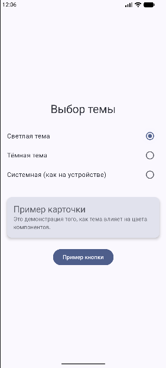
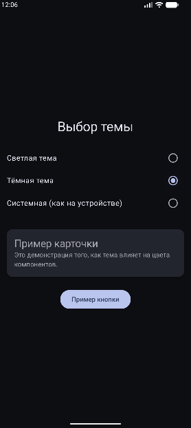
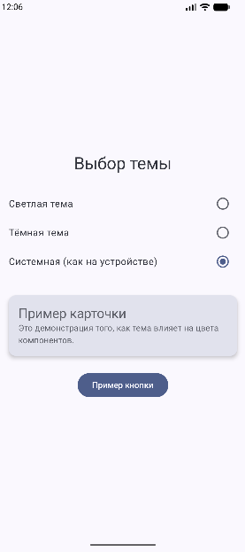

# Лабораторная работа №9

<div align="center">

**МИНИСТЕРСТВО НАУКИ И ВЫСШЕГО ОБРАЗОВАНИЯ РОССИЙСКОЙ ФЕДЕРАЦИИ**  
**ФЕДЕРАЛЬНОЕ ГОСУДАРСТВЕННОЕ БЮДЖЕТНОЕ ОБРАЗОВАТЕЛЬНОЕ УЧРЕЖДЕНИЕ ВЫСШЕГО ОБРАЗОВАНИЯ**  
**«САХАЛИНСКИЙ ГОСУДАРСТВЕННЫЙ УНИВЕРСИТЕТ»**

<br>
<br>

Институт естественных наук и техносферной безопасности  
Кафедра информатики  
**Пахомов Владимир Романович**

<br>
<br>
<br>
<br>

Лабораторная работа №9  
**Сохранение настроек темы. Тёмная/светлая тема в Compose**  
01.03.02 Прикладная математика и информатика  
3 Курс

<br>
<br>
<br>
<br>
<br>
<br>
<br>
<br>
<br>
<br>
<br>
<br>
<br>

<div align="right">
Научный руководитель<br>
Соболев Евгений Игоревич
</div>

<br>
<br>
<br>

г. Южно-Сахалинск  
2026 г.

</div>

## Цель работы

Изучить механизмы смены и сохранения темы приложения в Jetpack Compose, научиться использовать DataStore для хранения пользовательских настроек, реализовать переключение между тёмной и светлой темами.

## Индивидуальное задание: Три темы (Светлая / Тёмная / Системная)

Реализована возможность выбора трёх режимов темы: светлая, тёмная и системная (следование за настройками устройства). Выбор пользователя сохраняется через DataStore и восстанавливается после перезапуска приложения. Переключение осуществляется через RadioButton на главном экране.

## Скриншоты

  

<br>

  

<br>

  

## Листинги

### 1. build.gradle.kts

```kotlin
dependencies {
    implementation("androidx.datastore:datastore-preferences:1.0.0")
    implementation("androidx.lifecycle:lifecycle-viewmodel-compose:2.8.7")
    implementation("androidx.lifecycle:lifecycle-runtime-compose:2.8.7")
}
```

### 2. Color.kt

```kotlin
package com.example.themeswitcherapp.ui.theme

import androidx.compose.ui.graphics.Color
import androidx.compose.material3.*

val LightColors = lightColorScheme(
    primary = Color(0xFF006C4C),
    onPrimary = Color(0xFFFFFFFF),
    primaryContainer = Color(0xFF89F8C7),
    onPrimaryContainer = Color(0xFF002114),
    secondary = Color(0xFF4D635A),
    onSecondary = Color(0xFFFFFFFF),
    secondaryContainer = Color(0xFFCFE9DD),
    onSecondaryContainer = Color(0xFF0A1F19),
    background = Color(0xFFF4FBF5),
    onBackground = Color(0xFF161D1A),
    surface = Color(0xFFF4FBF5),
    onSurface = Color(0xFF161D1A)
)

val DarkColors = darkColorScheme(
    primary = Color(0xFF6CDBB0),
    onPrimary = Color(0xFF003825),
    primaryContainer = Color(0xFF005239),
    onPrimaryContainer = Color(0xFF89F8C7),
    secondary = Color(0xFFB3CCC1),
    onSecondary = Color(0xFF1F352D),
    secondaryContainer = Color(0xFF354B43),
    onSecondaryContainer = Color(0xFFCFE9DD),
    background = Color(0xFF161D1A),
    onBackground = Color(0xFFE1E3DF),
    surface = Color(0xFF161D1A),
    onSurface = Color(0xFFE1E3DF)
)
```

### 3. SettingsManager.kt

```kotlin
package com.example.themeswitcherapp.data

import android.content.Context
import androidx.datastore.preferences.core.edit
import androidx.datastore.preferences.core.intPreferencesKey
import androidx.datastore.preferences.preferencesDataStore
import kotlinx.coroutines.flow.Flow
import kotlinx.coroutines.flow.map

val Context.dataStore by preferencesDataStore(name = "settings")

class SettingsManager(private val context: Context) {

    companion object {
        val THEME_KEY = intPreferencesKey("theme_pref")
        const val THEME_LIGHT = 0
        const val THEME_DARK = 1
        const val THEME_SYSTEM = 2
    }

    val themeMode: Flow<Int> = context.dataStore.data
        .map { preferences ->
            preferences[THEME_KEY] ?: THEME_SYSTEM
        }

    suspend fun saveThemeMode(mode: Int) {
        context.dataStore.edit { preferences ->
            preferences[THEME_KEY] = mode
        }
    }
}
```

### 4. ThemeViewModel.kt

```kotlin
package com.example.themeswitcherapp.ui.theme

import androidx.lifecycle.ViewModel
import androidx.lifecycle.viewModelScope
import com.example.themeswitcherapp.data.SettingsManager
import kotlinx.coroutines.flow.SharingStarted
import kotlinx.coroutines.flow.StateFlow
import kotlinx.coroutines.flow.stateIn
import kotlinx.coroutines.launch

class ThemeViewModel(
    private val settingsManager: SettingsManager
) : ViewModel() {

    val themeMode: StateFlow<Int> = settingsManager.themeMode
        .stateIn(
            scope = viewModelScope,
            started = SharingStarted.WhileSubscribed(5000),
            initialValue = SettingsManager.THEME_SYSTEM
        )

    fun setThemeMode(mode: Int) {
        viewModelScope.launch {
            settingsManager.saveThemeMode(mode)
        }
    }
}
```

### 5. ThemeViewModelFactory.kt

```kotlin
package com.example.themeswitcherapp.ui.theme

import androidx.lifecycle.ViewModel
import androidx.lifecycle.ViewModelProvider
import com.example.themeswitcherapp.data.SettingsManager

class ThemeViewModelFactory(
    private val settingsManager: SettingsManager
) : ViewModelProvider.Factory {

    override fun <T : ViewModel> create(modelClass: Class<T>): T {
        if (modelClass.isAssignableFrom(ThemeViewModel::class.java)) {
            @Suppress("UNCHECKED_CAST")
            return ThemeViewModel(settingsManager) as T
        }
        throw IllegalArgumentException("Unknown ViewModel class")
    }
}
```

### 6. Theme.kt

```kotlin
package com.example.themeswitcherapp.ui.theme

import android.app.Activity
import android.os.Build
import androidx.compose.foundation.isSystemInDarkTheme
import androidx.compose.material3.*
import androidx.compose.runtime.*
import androidx.compose.runtime.SideEffect
import androidx.compose.ui.graphics.toArgb
import androidx.compose.ui.platform.LocalContext
import androidx.compose.ui.platform.LocalView
import androidx.core.view.WindowCompat
import androidx.lifecycle.viewmodel.compose.viewModel
import com.example.themeswitcherapp.data.SettingsManager

@Composable
fun ThemeSwitcherTheme(
    viewModel: ThemeViewModel = viewModel(
        factory = ThemeViewModelFactory(SettingsManager(LocalContext.current))
    ),
    content: @Composable () -> Unit
) {
    val context = LocalContext.current
    val themeMode by viewModel.themeMode.collectAsState()

    val isDarkTheme = when (themeMode) {
        SettingsManager.THEME_LIGHT -> false
        SettingsManager.THEME_DARK -> true
        else -> isSystemInDarkTheme()
    }

    val colorScheme = when {
        Build.VERSION.SDK_INT >= Build.VERSION_CODES.S -> {
            if (isDarkTheme) dynamicDarkColorScheme(context)
            else dynamicLightColorScheme(context)
        }
        isDarkTheme -> DarkColors
        else -> LightColors
    }

    val view = LocalView.current
    if (!view.isInEditMode) {
        SideEffect {
            val window = (view.context as Activity).window
            window.statusBarColor = colorScheme.primary.toArgb()
            WindowCompat.getInsetsController(window, view).isAppearanceLightStatusBars = !isDarkTheme
        }
    }

    MaterialTheme(
        colorScheme = colorScheme,
        typography = Typography(),
        content = content
    )
}
```

### 7. MainActivity.kt

```kotlin
package com.example.themeswitcherapp

import android.os.Bundle
import androidx.activity.ComponentActivity
import androidx.activity.compose.setContent
import androidx.compose.foundation.layout.*
import androidx.compose.material3.*
import androidx.compose.runtime.*
import androidx.compose.ui.Alignment
import androidx.compose.ui.Modifier
import androidx.compose.ui.unit.dp
import androidx.lifecycle.viewmodel.compose.viewModel
import com.example.themeswitcherapp.data.SettingsManager
import com.example.themeswitcherapp.ui.theme.ThemeSwitcherTheme
import com.example.themeswitcherapp.ui.theme.ThemeViewModel
import com.example.themeswitcherapp.ui.theme.ThemeViewModelFactory

class MainActivity : ComponentActivity() {
    override fun onCreate(savedInstanceState: Bundle?) {
        super.onCreate(savedInstanceState)
        val settingsManager = SettingsManager(this)

        setContent {
            ThemeSwitcherTheme(
                viewModel = viewModel(factory = ThemeViewModelFactory(settingsManager))
            ) {
                Surface(
                    modifier = Modifier.fillMaxSize(),
                    color = MaterialTheme.colorScheme.background
                ) {
                    ThemeScreen()
                }
            }
        }
    }
}

@Composable
fun ThemeScreen(viewModel: ThemeViewModel = viewModel()) {
    val themeMode by viewModel.themeMode.collectAsState()

    Column(
        modifier = Modifier
            .fillMaxSize()
            .padding(16.dp),
        horizontalAlignment = Alignment.CenterHorizontally,
        verticalArrangement = Arrangement.Center
    ) {
        Text(
            text = "Выбор темы",
            style = MaterialTheme.typography.headlineMedium
        )

        Spacer(modifier = Modifier.height(24.dp))

        Row(
            modifier = Modifier.fillMaxWidth(),
            horizontalArrangement = Arrangement.SpaceBetween,
            verticalAlignment = Alignment.CenterVertically
        ) {
            Text("Светлая тема")
            RadioButton(
                selected = themeMode == SettingsManager.THEME_LIGHT,
                onClick = { viewModel.setThemeMode(SettingsManager.THEME_LIGHT) }
            )
        }

        Row(
            modifier = Modifier.fillMaxWidth(),
            horizontalArrangement = Arrangement.SpaceBetween,
            verticalAlignment = Alignment.CenterVertically
        ) {
            Text("Тёмная тема")
            RadioButton(
                selected = themeMode == SettingsManager.THEME_DARK,
                onClick = { viewModel.setThemeMode(SettingsManager.THEME_DARK) }
            )
        }

        Row(
            modifier = Modifier.fillMaxWidth(),
            horizontalArrangement = Arrangement.SpaceBetween,
            verticalAlignment = Alignment.CenterVertically
        ) {
            Text("Системная (как на устройстве)")
            RadioButton(
                selected = themeMode == SettingsManager.THEME_SYSTEM,
                onClick = { viewModel.setThemeMode(SettingsManager.THEME_SYSTEM) }
            )
        }

        Spacer(modifier = Modifier.height(32.dp))

        Card(
            modifier = Modifier.fillMaxWidth(),
            elevation = CardDefaults.cardElevation(defaultElevation = 4.dp)
        ) {
            Column(
                modifier = Modifier.padding(16.dp)
            ) {
                Text(
                    text = "Пример карточки",
                    style = MaterialTheme.typography.titleLarge
                )
                Text(
                    text = "Это демонстрация того, как тема влияет на цвета компонентов.",
                    style = MaterialTheme.typography.bodyMedium
                )
            }
        }

        Spacer(modifier = Modifier.height(24.dp))

        Button(
            onClick = { }
        ) {
            Text("Пример кнопки")
        }
    }
}
```

## Ответы на контрольные вопросы

**1. Как в Compose определить, какая тема активна в данный момент (тёмная/светлая)?**

Используется функция `isSystemInDarkTheme()`, которая возвращает `true`, если на устройстве включена тёмная тема, и `false` — если светлая. Для кастомного выбора пользователя значение хранится в DataStore и считывается через StateFlow.

**2. Что такое `MaterialTheme.colorScheme` и какие основные цвета он содержит?**

`MaterialTheme.colorScheme` — это объект, содержащий цветовую палитру темы. Основные цвета: `primary`, `onPrimary`, `primaryContainer`, `secondary`, `onSecondary`, `background`, `onBackground`, `surface`, `onSurface`, `error`, `onError`.

**3. Как сохранить выбор темы пользователя между сессиями работы приложения?**

Через DataStore (или SharedPreferences). Выбор темы сохраняется в виде целого числа (0 — светлая, 1 — тёмная, 2 — системная). При запуске приложения значение считывается и применяется.

**4. В чём разница между `isSystemInDarkTheme()` и сохранённым пользовательским выбором?**

`isSystemInDarkTheme()` отражает системные настройки устройства (пользователь переключил тему в настройках телефона). Сохранённый выбор — это настройка внутри приложения. В работе реализован приоритет: если выбран режим «Системная», то используется `isSystemInDarkTheme()`, иначе — явный выбор пользователя.

**5. Что такое динамические цвета (dynamic color) и на каких версиях Android они доступны?**

Динамические цвета — это функция Android 12+, при которой цветовая схема приложения автоматически подстраивается под обои устройства. Доступны на Android 12 (API 31) и выше. В работе реализовано через `dynamicDarkColorScheme()` и `dynamicLightColorScheme()` при условии `Build.VERSION.SDK_INT >= Build.VERSION_CODES.S`.

## Вывод

В ходе выполнения лабораторной работы №9 было создано приложение `ThemeSwitcherApp` для управления темой оформления в Jetpack Compose.